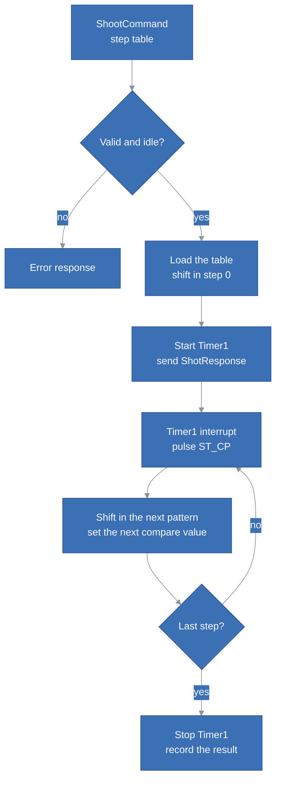
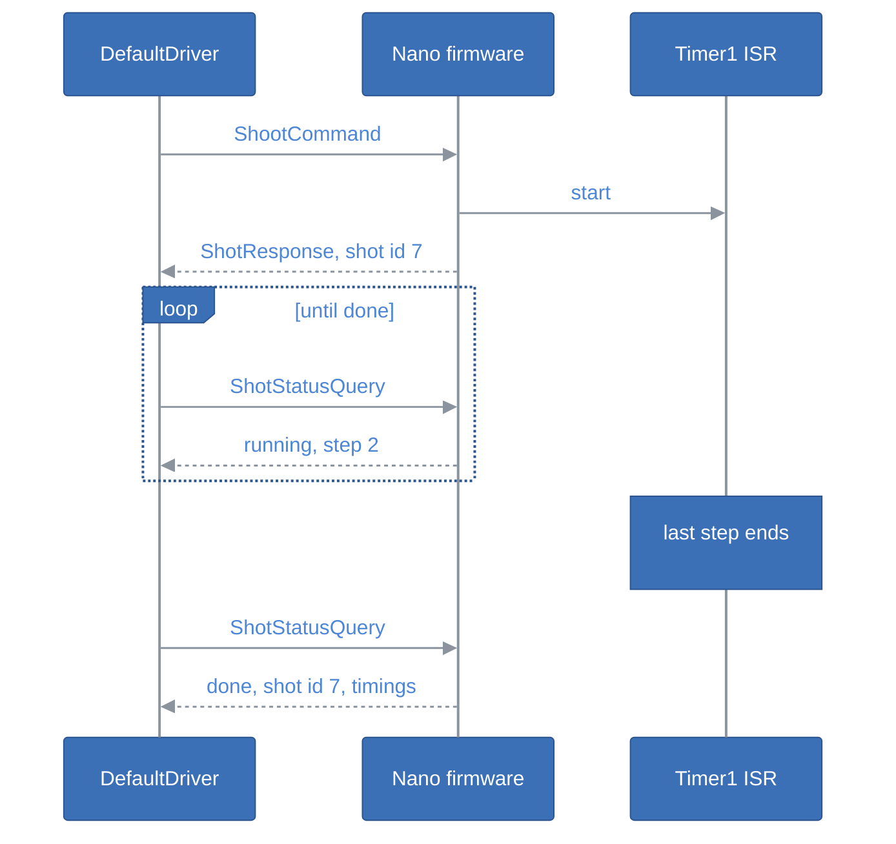
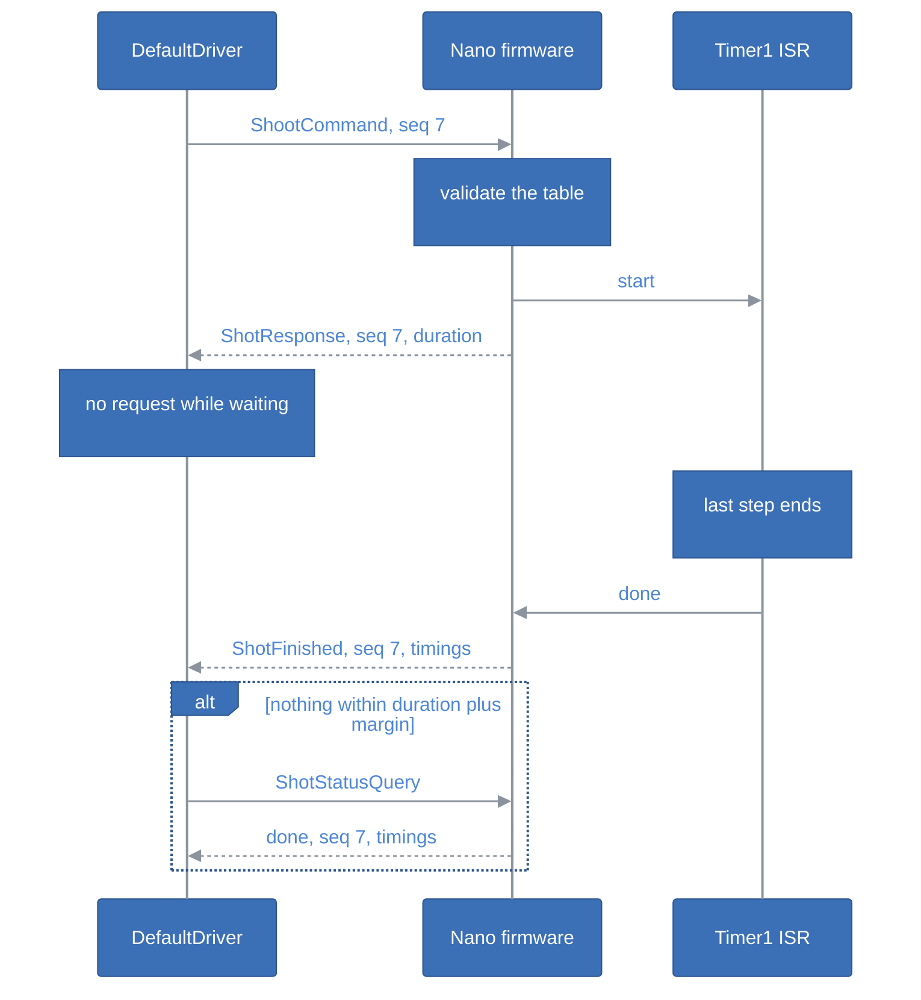
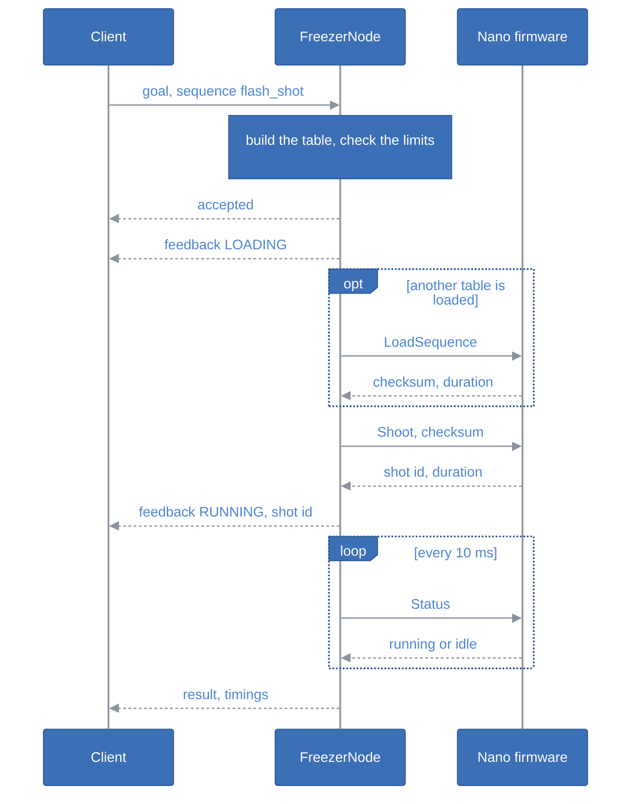

# Freezer Driver Brainstorming

## Table of Contents <!-- omit in toc -->

- [Introduction](#introduction)
- [Decisions](#decisions)
- [What We Start From](#what-we-start-from)
  - [The Freezer Board](#the-freezer-board)
  - [The StepIt Protocol](#the-stepit-protocol)
  - [The StepIt Old Protocol](#the-stepit-old-protocol)
- [The Shot](#the-shot)
  - [A Shot Is a Table of Steps](#a-shot-is-a-table-of-steps)
  - [Load, Then Trigger](#load-then-trigger)
  - [Richer Steps](#richer-steps)
  - [What the Firmware Rejects](#what-the-firmware-rejects)
  - [Recipes on the Host](#recipes-on-the-host)
  - [Keeping the Critical Path Precise](#keeping-the-critical-path-precise)
  - [What the Controller Does While Shooting](#what-the-controller-does-while-shooting)
- [Telling the Host the Shot Has Ended](#telling-the-host-the-shot-has-ended)
  - [Idea 1: The Host Polls a Status Query](#idea-1-the-host-polls-a-status-query)
  - [Idea 2: The Acknowledgement Carries the Duration](#idea-2-the-acknowledgement-carries-the-duration)
  - [Idea 3: The Controller Sends an Event](#idea-3-the-controller-sends-an-event)
  - [Idea 4: The Next Response Carries the News](#idea-4-the-next-response-carries-the-news)
  - [Idea 5: The Camera Tells Us](#idea-5-the-camera-tells-us)
  - [Idea 6: Two Answers to One Request](#idea-6-two-answers-to-one-request)
  - [Is the Acknowledgement the Right Way?](#is-the-acknowledgement-the-right-way)
  - [Comparison](#comparison)
  - [Decision](#decision)
- [A First Draft of the Protocol](#a-first-draft-of-the-protocol)
  - [The Handshake](#the-handshake)
  - [A Shot from the Host](#a-shot-from-the-host)
- [The ROS2 Side](#the-ros2-side)
  - [An Action, Not a Service](#an-action-not-a-service)
  - [The Shoot Action](#the-shoot-action)
  - [The Node Parameters](#the-node-parameters)
  - [Shots the Node Did Not Ask For](#shots-the-node-did-not-ask-for)
  - [Packages](#packages)
- [Testing Without the Board](#testing-without-the-board)
  - [The Fake Driver](#the-fake-driver)
  - [The Tests](#the-tests)
  - [Testing the Firmware Logic](#testing-the-firmware-logic)
- [Safety](#safety)
- [Open Questions](#open-questions)

## Introduction

Freezer Driver lets ROS2 fire the Freezer board: up to 7 cameras and a flash, through the optocouplers driven by two 74HC595 shift registers on an Arduino Nano. It talks to the board the way [StepIt Driver](https://github.com/kineticsystem/stepit-driver) talks to its Teensy: framed, CRC-checked request and response messages over the USB serial port.

This document collects ideas, and the decisions taken so far are listed in [Decisions](#decisions). The ROS2 packages and the firmware in `src` implement them, and fire shots on a Nano. See the [README](README.md) to build and run them. It follows one rule that everything else must respect: **once a shot starts, its timing belongs to the controller and nothing interrupts it**. The host asks for a shot and is told straight away that it has started, then polls until the controller says it has ended.

## Decisions

- **Timer1 runs the shot.** The table is walked by the Timer1 compare-match interrupt, with the next pattern shifted in ahead of time and latched on the interrupt. `loop()` stays free to answer the serial port during the shot, see [Keeping the Critical Path Precise](#keeping-the-critical-path-precise).
- **The host polls, Ideas 2 and 1.** `ShotResponse` returns at once with the shot id and the duration; the host waits that long and polls the status until the shot is done. The two-answer protocol of Idea 6 is not used.
- **The StepIt protocol, unchanged.** One request, one response, the same framing and CRC-16, no sequence number, no link-layer acknowledgement. The code is reused: `framed_serial` on the host, `SerialPort`, `DataBuffer`, `CrcUtils` and `Guard` in the firmware.
- **A table of steps, loaded, then fired.** `LoadSequence` sends the table, each step a 16-bit output bitmask and a hold time; `Shoot` fires the loaded table. See [A First Draft of the Protocol](#a-first-draft-of-the-protocol).
- **A handshake and a version, as in StepIt.** `connect()` sends `Info`; the controller answers with its version, major, minor and patch, and the name `FREEZER`. The driver refuses another name or another major version. See [The Handshake](#the-handshake).

## What We Start From

### The Freezer Board

The current sketch in `sketch/sketch.ino` of the Freezer project fires a fixed sequence when input D7 goes high. The PCB maps the 16 shift register bits to the jacks as follows, bit 0 being the first one shifted out:

| Bits | Jack | Use |
|---|---|---|
| 0 and 1 | OUT1 | camera 1, even bit shutter, odd bit focus |
| 2 to 13 | OUT2 to OUT7 | cameras 2 to 7, same layout |
| 14 and 15 | OUT8 | flash |
| - | IN1 | remote trigger on D7, pull-down R2 |

The Arduino pins are D2 `MR`, D3 `SH_CP`, D4 `DS`, D5 `OE` and D6 `ST_CP`. The latch matters for timing: all 16 outputs change together on the rising edge of `ST_CP`, however long the 16 bits take to shift in. D8 and the J2 and J3 headers are free.

> [!IMPORTANT]
> The pin labels on `freezer/motherboard/CircuitSchema.png` do not match the PCB. The PCB and `Freezer.h` agree, and they are the truth.

### The StepIt Protocol

Three properties of StepIt shape the ideas below:

- **Strict request and response.** `DefaultDriver` writes a frame and blocks on `read()` for the answer. The firmware never speaks first. A frame the host did not ask for would be read as the answer to the next request.
- **Framing.** Frames are delimited by `0x7E`, escaped with `0x7D`, and end with a CRC-16, as the `framed_serial` package implements it. The first byte of a request is the command id, the first byte of a response is `0x11` (success) or `0x12` (error).
- **A watchdog.** The firmware stops the motors when no message arrives for 1 second, so the host keeps talking.

The firmware side, `SerialPort` and `DataBuffer`, is plain Arduino code with buffers of 200 bytes. It should fit the 2 KB of RAM of the Nano, but we must check it.

### The StepIt Old Protocol

`~/repo/stepit-old` is the step between Freezer and StepIt Driver: one Nano drove two steppers and the Freezer board, and a Qt client drove the Nano. Its shot, `shootPicture()` in `arduino/StepIt/StepIt.ino`, runs this sequence on the same pins:

| Step | Pattern | Jacks | Hold |
|---|---|---|---|
| Pre-charge | `0x00AA` | focus on OUT1 to OUT4 | 100 ms |
| Open shutter | `0x00FF` | focus and shutter on OUT1 to OUT4 | 500 ms |
| Light on | `0xFFFF` | adds OUT5 to OUT8 | `flashTime`, 200 ms by default |
| Light off | `0x00FF` | OUT5 to OUT8 off | 200 ms |
| Close shutter | `0x0000` | all released | 200 ms |

Here the controller decides how long the subject is lit, so the precision of the `flashTime` step is the precision of the exposure.

Its protocol answers every request twice. Every frame starts with a sequence number. The firmware sends an acknowledgement, `[seq, 0x7F]`, as soon as a frame passes the CRC check, and the real response, `[seq, result]`, when the command has run. For the shot, `serial.flush()` pushes the acknowledgement out before the first output changes, so the acknowledgement means "started" and the response means "finished". The client resends a frame that is not acknowledged within 500 ms, up to 5 times, and matches the response to its request by the sequence number.

What we must not carry over:

- **The timing.** The shot is a chain of `delay()` calls, each step changes only after a `digitalWrite` shift of a few hundred microseconds, and the whole controller is deaf for about 1.2 s.
- **A retransmission fires a second shot.** When an acknowledgement is lost, the client resends the same frame and the firmware runs it again: nothing remembers the last sequence number.
- **The acknowledgement means "received", not "accepted".** It leaves before the command is decoded, so an unknown command is acknowledged and never answered, and the client, which has no timeout on the response, waits forever.
- **A typo.** `else if (cmd = SWITCH_LIGHT_CMD && ...)` assigns instead of comparing: any unknown command with a one-byte payload switches the lights.

## The Shot

### A Shot Is a Table of Steps

The sketch hard-codes four steps of 100, 100, 100 and 200 ms. A `ShootCommand` could carry the sequence instead, as a list of steps, each a 16-bit output pattern and how long to hold it:

| Step | Pattern | Hold |
|---|---|---|
| Focus | odd bits of the selected cameras | `focus_us` |
| Shutter | both bits of the selected cameras | `shutter_to_flash_us` |
| Flash | the same, plus bits 14 and 15 | `flash_us` |
| Release | `0x0000` | `cooldown_us` |

The host builds the table from parameters it understands, cameras and delays, and the controller only replays it. This keeps the firmware small and lets us change the sequence, e.g. a second flash or a camera fired later than the others, without flashing new firmware. At 7 bytes a step, 16 steps fit in one frame, see [A First Draft of the Protocol](#a-first-draft-of-the-protocol).

Both sequences we already have are tables: the flash shot of the Freezer sketch and the timed light of StepIt Old differ only in their rows.

A simpler alternative is a fixed sequence with four durations and a camera mask. It is enough for today's use, and the protocol can grow into the table later.

### Load, Then Trigger

The table can travel in its own command instead of inside the shot. A `LoadSequence` command sends the table once; the firmware validates it and keeps it. A `Shoot` command of 3 bytes fires the stored table.

- **The shot starts sooner.** The frame that starts it is short, and the validation has already happened.
- **The same table is fired many times.** A focus stack of 200 shots sends the table once.
- **The remote trigger can use it.** IN1 can fire the stored table, so the button and ROS2 shoot the same way.

The price is state in the controller: the host must know which table is loaded. The `LoadSequence` answer can return a checksum of the table, and the `ShotResponse` the same checksum, so the host can tell that the table it meant is the one that ran.

### Richer Steps

A step that only sets a pattern and waits is enough for the shots we know. Two more kinds of step open new ones:

| Step | What it does | Use |
|---|---|---|
| Set and hold | output a pattern, wait a fixed time | every shot |
| Repeat | run steps `i` to `j` again, `n` times | a strobe, several flashes in one exposure, a burst |
| Wait for input | wait for D7 or D8 to go high, with a timeout | fire the flash on the X-sync of a camera instead of after a fixed delay |

A wait for an input makes the duration of the shot unknown in advance. That is the trade-off: a table of fixed holds has a duration the host can compute, a table with a wait does not. It is one more reason to confirm the end of the shot and never rely on the prediction alone, see [Idea 2](#idea-2-the-acknowledgement-carries-the-duration).

We do not need the richer steps today. Reserving a step type byte in the table now lets us add them without changing the frame.

### What the Firmware Rejects

A generic table moves the responsibility for a safe shot from the firmware code to the table, so the firmware must check every table before keeping it. It rejects a table:

- **that does not end with `0x0000`.** A camera must never be left with its shutter held, and a light must never stay on.
- **with more steps than it can store**, e.g. 8 or 16, depending on the RAM left on the Nano.
- **longer in total than a limit**, e.g. 10 s, computed with the repeats unrolled and the waits counted at their timeout.
- **with a hold shorter than it can time**, 40 µs on the Nano: the interrupt, the latch and the shift of the next pattern take about 27.5 µs, measured, and shorter steps fall behind one after the other.
- **with a repeat that points outside the table or forward**, or nested repeats, if we do not support them.

A rejected table changes nothing: the previous table stays loaded and the outputs do not move.

### Recipes on the Host

The ROS2 interface should not speak in bit patterns. A small builder in `freezer_driver` turns named recipes into tables:

| Recipe | Parameters | Table |
|---|---|---|
| Flash shot | cameras, focus, shutter-to-flash, flash, cooldown | the Freezer sketch sequence |
| Timed light | cameras, focus, shutter-to-light, light time, light-to-close, cooldown | the StepIt Old sequence |
| Strobe | cameras, flash count, flash interval | a repeat around the flash step |

The recipes and their parameters live in the parameters of the node, and the action goal names one, see [The Shoot Action](#the-shoot-action). The builder knows the jack to bit mapping of the board. A raw table can still be sent for experiments.

### Keeping the Critical Path Precise

On the ATmega328P of the Nano, three things decide how precise a step boundary is:

- **Who keeps time.** `delay()` and `loop()` are not precise enough to trust. Timer1, the 16-bit timer, can fire a compare-match interrupt at each step boundary with a resolution of 0.5 µs at a prescaler of 8, and up to about 32 ms per period; longer steps count several periods.
- **How long a write takes.** The sketch calls `digitalWrite` about 70 times per write, a few hundred microseconds. Writing the port registers directly takes about 10 µs. Better still, the interrupt only pulses `ST_CP`: the next pattern is shifted in ahead of time, during the current step, and the latch makes it appear at the exact moment.
- **What else runs.** The UART receive and transmit interrupts and the `millis()` timer can delay the Timer1 interrupt by a few microseconds. That is two to three orders of magnitude below the shortest step, and below the jitter of a camera shutter, which is in the order of milliseconds.

The extreme alternative is to disable interrupts for the whole shot and count cycles. The timing is then perfect, but the UART loses any byte that arrives during the shot, `millis()` stops, and the controller cannot answer anything. We would need it only if a few microseconds of jitter mattered, and they do not.



### What the Controller Does While Shooting

With the timer driving the steps, `loop()` stays free and keeps serving the serial port during the shot. That gives the controller three choices for a request that arrives mid-shot:

- **Answer queries, refuse commands.** A status or info query is answered; a second `ShootCommand` gets a "busy" error. This is the choice that makes polling possible.
- **Answer nothing.** The host must not send during a shot. Simple, but the host then needs to know the duration, and the watchdog must be suspended.
- **Queue the next shot.** Useful for a burst, but it is a feature we do not need yet.

The ISR should also measure itself: the `micros()` at each step boundary, or at least the worst lateness, kept for the host to read. It costs a few bytes of RAM and turns "it should be precise" into a number we can check.

## Telling the Host the Shot Has Ended

### Idea 1: The Host Polls a Status Query

The controller keeps a shot state: idle, running or done, the shot id, the step it is on and the measured timings. A `ShotStatusQuery` returns it. The host polls until it reads "done" for its shot id.



It keeps the protocol exactly as StepIt has it, and the polling doubles as the watchdog heartbeat. The price is latency, up to one polling period, and a few small frames during the shot, which the ISR barely notices.

### Idea 2: The Acknowledgement Carries the Duration

The `ShotResponse` returns the shot id and the total duration of the table. The host knows the end time without asking, sleeps until then, and sends one status query to confirm. It is Idea 1 with one poll instead of many, and it leaves the serial line silent during the shot.

The host already knows the duration, since it built the table, but having the controller say it confirms that both agree on what will happen.

**The known duration is a prediction, not a proof.** Three things blur it:

- **The clock of the Nano.** Depending on the board, the ATmega328P runs from a crystal, within about 50 ppm, or from a ceramic resonator, within about 0.5%: up to 6 ms on a shot of 1.2 s.
- **The USB latency.** The FT232 of the Nano 3.0 holds received bytes for up to 16 ms before passing them to the host, the default of its latency timer on Linux. The host does not know when the shot started to better than that. The timer can be lowered to 1 ms in `/sys/bus/usb-serial/devices/ttyUSB0/latency_timer`.
- **Failures.** A controller that reset in the middle of the shot is silent, exactly like one that finished on time.

So the predicted end is a deadline: the host waits until then, plus a margin, and then needs a confirmation, either the second answer of Idea 6 or one status query.

### Idea 3: The Controller Sends an Event

When the shot ends, the controller sends a `ShotFinished` frame on its own. The host learns the end within about a millisecond.

The price is in the host: the request and response pairing of `DefaultDriver` no longer holds. A reader thread must own the serial port, tell responses from events by a message type byte, deliver responses to whoever is waiting and events to a callback. The two can cross on the wire: the event can arrive while the host waits for the answer to a status query. This is the biggest change to the StepIt design, and it is only worth it if we need the end of a shot within a millisecond.

### Idea 4: The Next Response Carries the News

Every response gets a small header with the state of the last shot. The host learns the end from whatever it sends next, usually the watchdog heartbeat. It keeps the pairing, but mixes shot state into unrelated messages, and the latency is the heartbeat period.

### Idea 5: The Camera Tells Us

The real end of a shot is not the end of the table but the camera writing a picture. StepIt Camera already downloads every picture the camera takes. A node that combines the two could wait for the `ShotFinished` of Freezer and for the picture of each camera. This does not replace the other ideas, it adds a second check: a camera that did not fire shows up as a missing picture.

A hardware version of the same idea uses the free D8: the X-sync of one camera, from its hot shoe or PC socket, tells the controller when the shutter is fully open. The flash could even be fired by it instead of by a fixed delay.

### Idea 6: Two Answers to One Request

This is the StepIt Old protocol, with its faults fixed. A `ShootCommand` gets two answers carrying the same sequence number: a `ShotResponse` when the shot starts and a `ShotFinished` when it ends. Every other command keeps its single answer.



The rules that make it safe:

- **The first answer means "accepted and started".** The firmware sends it after validating the command and starting the timer, not when the frame arrives. A rejected command gets an error and no second answer.
- **A repeated sequence number is not run twice.** The firmware keeps the last sequence number and its answers. A frame that repeats it, because the host resent it, gets the cached answer back.
- **One request in flight.** Between the two answers the host sends nothing, so nothing else can be answered in between and the pairing stays simple: whatever arrives is about the shot.
- **The host has a deadline.** If `ShotFinished` is not there within the duration plus a margin, e.g. 100 ms, the host asks with a `ShotStatusQuery`, Idea 1, which also tells a lost frame from a controller that reset.

### Is the Acknowledgement the Right Way?

StepIt Old acknowledged every frame in the link layer and answered in the command layer. That is two separate ideas, and only the second one is worth keeping.

**A link-layer acknowledgement for every frame is not worth it.** It protects against a frame lost on a USB serial link, which almost never happens, and the link is already checked by the CRC. It doubles the frames, and it brings retransmission, which is exactly what fired the second shot. StepIt Driver works without it: one request, one response, and a timeout. If a frame is lost, the timeout catches it, and the host can always ask the state.

**Two answers for the one command that takes time are worth it.** The second answer is what tells the host "finished" within a millisecond and with no traffic during the shot. It is not an unsolicited event: it answers a request the host made, carries its sequence number, and arrives when the host expects it.

What it costs, compared with polling:

- **The host read path changes for one command.** `DefaultDriver` today reads one frame per request. `shoot()` reads the first answer and returns; a second call, e.g. `wait_shot_finished(timeout)`, reads the second. Any other call between the two is an error.
- **The link is busy during the shot.** That cost StepIt Old its motors, which lived on the same Nano and stopped for every shot. Freezer has its own controller now and nothing else to do, so it costs nothing here.
- **The watchdog is silent during the shot.** No heartbeat can be sent while waiting. That matches the rule that a shot always runs to the end; the watchdog applies again once `ShotFinished` is sent.
- **A lost `ShotFinished` needs a way back.** The status query of Idea 1 is that way back, so we build both.

Polling, Idea 1 and 2, avoids all of this at the price of traffic during the shot and up to one polling period of delay. Both are sound. The difference is whether we prefer one special command in the host or a polling loop.

### Comparison

| Idea | Latency of the end | Protocol change | Host change |
|---|---|---|---|
| 1, polling | one polling period, e.g. 10 ms | one query | a polling loop |
| 2, duration | one query after the end | one field | a timer |
| 3, event | about 1 ms | a message type | a reader thread |
| 4, piggy-back | the heartbeat period | a header on every response | small |
| 5, camera | seconds, after the download | none | a node that joins the two |
| 6, two answers | about 1 ms | a sequence number, a second answer for the shot | a second read for the shot |

### Decision

**Ideas 2 and 1.** The `ShotResponse` carries the shot id and the duration; the host waits that long, then polls the status every 10 ms until it reads "done". It keeps the StepIt protocol, its code and its tests as they are, the controller is the authority on whether the shot has ended, and the measured timings come back with the status.

The timer makes this possible: polling is served by `loop()`, and the Timer1 interrupt latches each pattern at its count whatever `loop()` is doing. A poll can delay a step only by the length of another interrupt, a few microseconds, and that delay does not add up from step to step. The rules that keep it so:

- **No long critical section in `loop()`.** Copying the shot state for a status answer uses the `Guard` flags of StepIt or an atomic block of a few microseconds. No library that disables interrupts for long, e.g. `SoftwareSerial`.
- **A short interrupt.** Latch, shift the next pattern with direct port writes, set the next compare value: about 27.5 µs in all, measured on the Nano. No serial, no `digitalWrite`, no floating point.
- **Safe reads of shared state.** A 16-bit or 32-bit value read by `loop()` can be torn by the interrupt on an 8-bit microcontroller, so it is read under a guard.

Learning the end of the shot late, by up to one polling period plus the USB latency, is harmless when the cooldown alone is 200 ms.

## A First Draft of the Protocol

The framing, the CRC-16 and the byte order, most significant byte first, are those of StepIt. A response starts with `0x11` for success or `0x12` for an error. An error carries a reason byte after it: `DefaultDriver` of StepIt reads only the first byte, so the reason costs nothing to a reader that ignores it.

| Id | Command | Request payload | Success payload |
|---|---|---|---|
| `0x76` | `Info` | none | version, limits and the name `FREEZER`, see [The Handshake](#the-handshake) |
| `0x75` | `Status` | none | state, 1 byte; loaded table checksum, 2 bytes; last shot id, 2 bytes; current step, 1 byte; elapsed, 4 bytes in µs; worst lateness of the last shot, 4 bytes in µs |
| `0x7B` | `LoadSequence` | step count, 1 byte; then per step: type, 1 byte; bitmask, 2 bytes; hold, 4 bytes in µs | table checksum, 2 bytes; total duration, 4 bytes in µs |
| `0x7C` | `Shoot` | expected table checksum, 2 bytes | shot id, 2 bytes; total duration, 4 bytes in µs |
| `0x79` | `Echo` | anything | the same bytes |

- **Ids.** `Info`, `Status` and `Echo` keep their StepIt ids, and `Shoot` keeps the id it had in StepIt Old. A StepIt controller on the wrong port answers `Info` with the name `STEPIT` and is refused.
- **The step.** Type `0x00` is "set and hold"; the other values are reserved for [Richer Steps](#richer-steps). The bitmask is the 16 outputs, bit 0 being OUT1 shutter, see [The Freezer Board](#the-freezer-board). A step is 7 bytes, and 16 steps make a payload of 114 bytes, 116 with the CRC, under the 200 bytes of the StepIt receive buffer, which keeps the bytes unescaped.
- **The checksum.** `LoadSequence` returns the CRC-16 of the table, and `Shoot` sends it back. The controller refuses to shoot a table other than the one the host means, e.g. after a reset that cleared it.
- **The state.** `0x00` idle, `0x01` running. A shot is over for the host when the state is idle and the last shot id is the one `Shoot` returned.

| Error reason | When |
|---|---|
| `0x01` malformed | the payload has the wrong length or an unknown command id |
| `0x02` invalid table | the table breaks a rule of [What the Firmware Rejects](#what-the-firmware-rejects) |
| `0x03` busy | `LoadSequence` or `Shoot` while a shot runs |
| `0x04` no table | `Shoot` before any table is loaded |
| `0x05` wrong table | the checksum of `Shoot` is not the one of the loaded table |

### The Handshake

The serial port path alone does not tell the driver what is attached, so `connect()` checks it, as StepIt Driver does. It sends `Info` and reads the answer, laid out as in StepIt, the limits before the name so that the name stays "the remaining bytes":

| Field | Size |
|---|---|
| status | 1 byte, `0x11` |
| version | 3 bytes: major, minor and patch |
| maximum steps | 1 byte |
| minimum hold | 4 bytes, in µs |
| maximum duration | 4 bytes, in µs |
| name | the remaining bytes, in ASCII: `FREEZER` |

The driver accepts the controller only when:

1. **The name is `FREEZER`.** Any other name, e.g. `STEPIT` from a StepIt Teensy on the wrong port, is refused at once, without more attempts: the device answered, it is the wrong one.
2. **The major version is the one the driver speaks.** Otherwise the driver refuses, logs both versions and says to flash the firmware that matches the workspace.

Then it logs the firmware version and keeps the limits, which the recipe builder and the `FakeDriver` use to reject a table before sending it.

**The version.** The firmware defines `VERSION_MAJOR`, `VERSION_MINOR` and `VERSION_PATCH`, the driver `kExpectedProtocolVersion`, as in StepIt. The first version is `1.0.0`, which answers `Info` and `Echo`; `1.1.0` adds `LoadSequence`, `Shoot` and `Status`, a minor version since a driver of 1.0.0 knows nothing of them.

| Part | Changes when | Driver |
|---|---|---|
| major | the wire changes: a command id, a field, a size, a meaning | refuses another major |
| minor | something is added that an older driver can ignore, e.g. a new command | accepts, logs it |
| patch | a fix with no change on the wire | accepts, logs it |

The firmware and the driver live in the same repository, so a change of the wire changes both, and the major version, in the same commit.

**The Nano resets when the port opens.** Unlike the Teensy of StepIt, which has native USB, the Nano 3.0 is reset by the DTR line of the FT232 every time the host opens the port. The bootloader then listens for an upload before the firmware starts, and a frame sent in that time is lost. On our Nano, with the old bootloader, the first `Info` was answered 0.65 s after opening the port, at the 4th attempt. StepIt's 5 attempts, 0.2 s of timeout and 100 ms apart, last about 1.5 s: enough for this Nano, with little margin, and not for a bootloader that waits longer. The driver waits after opening the port, a `connect_delay` parameter of 1 s by default, before its first `Info`. Keeping the port open for the whole session matters for the same reason: every reopen restarts the controller and clears the loaded table.

> [!NOTE]
> In StepIt Driver, `stepit.ros2_control.xacro` sets `baud_rate` while `DefaultSerialFactory` reads `baudrate`, so the xacro value is ignored and the default of 9600 is used. Both happen to be 9600 today. When we reuse the factory we should fix the name in one of the two.

### A Shot from the Host

1. `LoadSequence` once, keep the checksum and the duration.
2. `Shoot` with the checksum, keep the shot id.
3. Wait for the duration.
4. `Status` every 10 ms until it is idle with that shot id, or fail after the duration plus 100 ms.

## The ROS2 Side

### An Action, Not a Service

A shot has a start, a duration and an end, which is what a ROS2 action is for. A client such as a focus stacking sequence can move the StepIt rail, wait for it to settle, send a goal, wait for the result, and move on.

`ros2_control` does not fit here: there is no joint and no control loop, only a command and its result. A plain node with an action server, as in StepIt Camera, is simpler.

### The Shoot Action

The goal names a sequence defined in the parameters of the node, or carries a raw table. Most clients send a name, or nothing for the default sequence: the setup of the rig changes rarely, and a focus stack fires the same shot hundreds of times.

`freezer_msgs/action/Shoot.action`:

```
# Goal

# The name of a sequence in the node parameters. Empty for default_sequence.
# Ignored when steps is not empty.
string sequence

# A raw table, for experiments. When not empty, it is sent as it is.
freezer_msgs/Step[] steps

---

# Result

# Why the shot failed, empty on success.
string message

# The id the controller gave the shot.
uint16 shot_id

# Host time when the controller confirmed the start of the shot.
builtin_interfaces/Time started

# Duration of the table, as computed by the controller.
uint32 duration_us

# The latest a step boundary came after its time, as measured by the controller.
uint32 worst_lateness_us

---

# Feedback

uint8 LOADING = 0  # the table is being validated and loaded
uint8 RUNNING = 1  # the controller has started the shot
uint8 state

# Valid when RUNNING.
uint16 shot_id
uint32 duration_us
uint8 step
uint32 elapsed_us
```

`freezer_msgs/msg/Step.msg`:

```
# One step of a shot: output a pattern, then hold it.

uint8 SET_AND_HOLD = 0  # the other values are reserved for repeat and wait steps
uint8 type

# The 16 outputs, a bit per optocoupler: for jack k, bit 2(k-1) is the
# shutter and bit 2(k-1)+1 the focus.
uint16 OUT1_SHUTTER = 1
uint16 OUT1_FOCUS = 2
uint16 OUT2_SHUTTER = 4
uint16 OUT2_FOCUS = 8
# ... up to
uint16 OUT8_SHUTTER = 16384
uint16 OUT8_FOCUS = 32768
uint16 outputs

# How long to hold the pattern, in µs.
uint32 hold_us
```

The hold is a `uint32` in microseconds, not a `builtin_interfaces/Duration`: it is what the controller counts, and a client sees exactly what will run, with no rounding.

**The shot starts with the first `RUNNING` feedback.** That is the ROS2 side of the `ShotResponse`. The status of the goal cannot say it: a goal goes from accepted to executing to succeeded or aborted, and cannot be aborted before it executes, so the goal executes from the start and the feedback tells the two phases apart. The feedback is a hint, not a guarantee: ROS2 drops the feedback published before the client has processed the acceptance of its goal, so a fast shot can reach the client with no `LOADING` and without its first `RUNNING`. The result carries the shot id and the time the shot started, whatever feedback arrived.

**The rules of the server:**

| Callback | Does |
|---|---|
| `handle_goal` | rejects the goal when the driver is not connected, when a goal is already active, or when the table breaks a rule of the limits read at the handshake; accepts and executes it otherwise |
| `handle_cancel` | accepts while `LOADING`, rejects once `RUNNING`: a shot that has started always runs to the end |
| execution | loads the table when its checksum differs from the loaded one, sends `Shoot`, publishes `RUNNING`, polls the status and publishes it as feedback, and succeeds when the controller is idle with the shot id; aborts with a `message` on an error or a timeout |

A rejection carries no reason in ROS2, so the node logs it, and the rules are the ones `Info` reported, which a client can read too. Validating in `handle_goal` costs no serial traffic: the limits are known since the handshake.

One goal at a time keeps the controller simple, and the polling, the loading and the shot run on one thread that owns the driver, as StepIt Camera owns its camera.



### The Node Parameters

The sequences are parameters, so they are set in a YAML file and can be changed at runtime with `ros2 param set`; a changed sequence is loaded into the controller before its next shot.

```yaml
freezer:
  ros__parameters:
    use_fake: true
    usb_port: /dev/ttyUSB0
    baudrate: 9600
    timeout: 0.2          # s, for one answer
    connect_delay: 1.0    # s, the Nano resets when the port opens
    poll_period: 0.01     # s
    end_margin: 0.1       # s, after the duration, before giving up
    default_sequence: flash_shot
    sequence_names: [flash_shot, timed_light]
    sequences:
      flash_shot:
        recipe: flash
        cameras: [1, 2, 3, 4, 5, 6, 7]
        flashes: [8]
        focus_ms: 100.0
        shutter_to_flash_ms: 100.0
        flash_ms: 100.0
        cooldown_ms: 200.0
      timed_light:
        recipe: timed_light
        cameras: [1, 2, 3, 4]
        lights: [5, 6, 7, 8]
        focus_ms: 100.0
        shutter_to_light_ms: 500.0
        light_ms: 200.0
        light_to_close_ms: 200.0
        cooldown_ms: 200.0
```

`sequence_names` is there because a ROS2 node must declare a parameter before reading it, and the names tell it which `sequences.<name>.*` to declare. The durations are in milliseconds for people to read; the builder rounds them to microseconds.

With the node running, a shot from the command line:

```
ros2 action send_goal --feedback /freezer/shoot freezer_msgs/action/Shoot "{sequence: flash_shot}"
```

### Shots the Node Did Not Ask For

The IN1 button fires the loaded table without the node. When the node polls the status while idle, as the watchdog heartbeat, a new shot id tells it that a shot happened. It could publish every shot, its own and the button's, on a `~/shots` topic, so that a node collecting pictures, e.g. StepIt Camera, knows a shot was fired whoever fired it.

### Packages

Following the layout of StepIt Driver:

| Package | Role |
|---|---|
| `freezer_driver` | `Driver` interface, `DefaultDriver` over the serial port, `FakeDriver` that runs the table with a host clock, the recipe builder |
| `freezer_msgs` | the `Shoot` action |
| `freezer_node` | the action server, parameters for the serial port, `use_fake` and the default durations |
| `freezer_mcu` | PlatformIO project for the Nano, not built by colcon |
| `framed_serial` | shared with StepIt Driver, as the submodule `modules/framed-serial` |

## Testing Without the Board

StepIt Driver runs without motors: `FakeDriver` implements the same `Driver` interface as `DefaultDriver`, with `FakeMotor` computing where a motor would be from the time it is given. Freezer Driver needs the same, so that the node, the action and the recipes can be developed and tested on any computer.

### The Fake Driver

`FakeDriver` implements `Driver` and plays the part of the firmware:

- **It validates tables with the same rules** as the firmware, see [What the Firmware Rejects](#what-the-firmware-rejects), and answers with the same errors.
- **It runs the table on a clock it is given**, as `FakeMotor` computes from the `rclcpp::Time` it receives. Tests drive the clock by hand and never sleep: a shot of 1.2 s takes no time to test.
- **It records the timeline**, every pattern and the time it was latched, so a test can assert "camera 3 focused at 0 ms, shutter at 100 ms, flash at 200 ms".
- **It answers as the controller would**, the `ShotResponse` at the start and, for Idea 6, `ShotFinished` at the end, or "running" and "done" to a status query.
- **It can be told to fail**: never send `ShotFinished`, reset in the middle of a shot, refuse a table, or report a step that ran late. These are the paths that are hard to provoke with the real board, and the ones the host code must get right.

The node chooses the fake with a `use_fake` parameter, as StepIt chooses it with `use_dummy` in its `ros2_control` xacro. It is `true` by default, so the project runs without hardware.

### The Tests

| Test | What it covers |
|---|---|
| `test_fake_driver` | the fake runs a table, records the timeline, and fails when told to |
| `test_default_driver` | the frames `DefaultDriver` sends and how it reads the answers, against a GMock of `FramedSerial`, as in StepIt |
| `test_sequence` | the encoding of a table, its checksum and the rules of the controller |
| `test_recipes` | each recipe produces the expected table, and the jack to bit mapping |
| `test_freezer_node` | the action against `FakeDriver`: accepted, feedback, result, goals rejected while a shot runs or with a bad table, a shot that never ends, a controller that resets |
| `test_sequencer` | the firmware sequencer, compiled for the host, see below |

### Testing the Firmware Logic

The precise part, the sequencer that walks the table, can be written as a plain C++ class with no Arduino calls: it is given the time of each timer interrupt and returns the next pattern and the next compare value. The ISR and the port writes stay in a thin layer around it.

PlatformIO can then build the same class for the host, with a `native` environment and its unit test runner, and test the repeats, the waits, the timeouts and the rejection rules without the Nano. Only the timing itself, the microseconds between latches, needs the board and a logic analyser or an oscilloscope on `ST_CP`.

The fake driver and the firmware sequencer must not drift apart. Sharing the validation code between them, a header compiled into both, keeps the rules in one place.

## Safety

- **A shot always runs to the end.** The watchdog must not cut it short: releasing the shutter mid-way leaves a camera in an unknown state. The watchdog only applies while idle.
- **Idle means all outputs off.** At power on, at reset, and when the watchdog fires while idle, the controller writes `0x0000` and pulls `MR` low. A camera must never be left with its shutter held.
- **Validate before touching anything.** As in StepIt, a malformed table, a step too long or a bit outside the 16 is rejected before the first output changes.
- **The handshake.** An info query returns the name `FREEZER` and the protocol version, so the driver refuses to talk to a StepIt Teensy on the wrong port, or to a Freezer with firmware that speaks another protocol. See [The Handshake](#the-handshake).
- **The remote trigger.** IN1 can keep working as today, or be disabled while the host is connected, so that a cable bumped during a session does not fire a shot. The controller should report a shot it started on its own.

## Open Questions

- What was plugged into OUT5 to OUT8 in StepIt Old: flash units, or continuous lights pulsed for `flashTime`?
- Does the table survive a power cycle, stored in the EEPROM, or must the host load it after every connection?
- Does the shot id count from 0 at every reset, or does `Info` also return a boot counter so the host can tell a reset?
- Do we want repeat and wait steps in the first version, or only reserve the step type byte for them?
- Does our Nano run from a crystal or a resonator? Our Nano has a genuine FT232R, with its latency timer at 16 ms: do we lower it to 1 ms? An `Info` round trip takes 48 ms at 9600 baud today.
- Do we keep the Nano and the current board, or move to a Teensy like StepIt? The Teensy has more RAM and native USB, but the board is designed for the Nano footprint.
- What is the shortest step we need, and the longest? This sets the Timer1 prescaler.
- Should the controller time each camera separately, for cameras with different shutter lag?
- Is OUT8 always the flash, or should any jack be a camera or a flash?
- Do we want IN1 while ROS2 is in control?
- Do we join Freezer and StepIt Camera into one node that knows when every picture has arrived?
