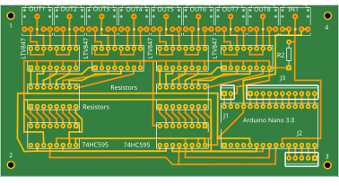
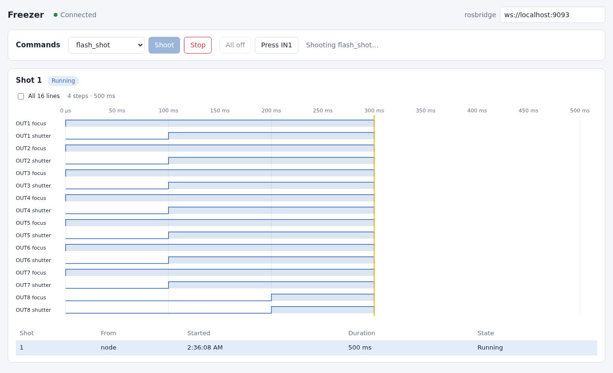

# StepIt Freezer

[](https://github.com/kineticsystem/stepit-freezer/actions/workflows/industrial_ci.yml)
[](https://github.com/kineticsystem/stepit-freezer/actions/workflows/ci-format.yml)
[](https://github.com/kineticsystem/stepit-freezer/actions/workflows/ci-ros-lint.yml)



## Table of Contents <!-- omit in toc -->

- [Introduction](#introduction)
- [Prerequisites](#prerequisites)
- [Install StepIt Freezer on the Microcontroller](#install-stepit-freezer-on-the-microcontroller)
  - [Connect the Arduino Nano](#connect-the-arduino-nano)
  - [Access the Serial Port](#access-the-serial-port)
  - [Flash the Firmware](#flash-the-firmware)
- [Install StepIt Freezer on the Local Computer](#install-stepit-freezer-on-the-local-computer)
  - [Check out the Submodules](#check-out-the-submodules)
  - [Pre-Commit Hooks](#pre-commit-hooks)
  - [Build the Project](#build-the-project)
- [Running the Application](#running-the-application)
  - [The Board Page](#the-board-page)
  - [Parameters](#parameters)
- [Troubleshooting](#troubleshooting)
- [How to run GitHub Actions locally](#how-to-run-github-actions-locally)

## Introduction

StepIt Freezer is a project to fire cameras and flashes from ROS2, through the Freezer board: an Arduino Nano driving two 74HC595 shift registers and 16 optocouplers, wired to 8 output jacks and 1 input jack.

- Fire up to 7 cameras and a flash at the same time, with the timing of each step kept by a hardware timer of the Nano.
- Load a sequence of steps once, each an output pattern and a hold time, and fire it with one short command, or with the remote trigger on IN1.
- Switch outputs on and off outside a shot, e.g. the lights, and stop a shot at any time.
- Watch the board in a web page: its outputs live, the commands, and the timing of every shot, against a fake controller or the real board.
- Talk to the Nano with a framed, CRC-checked protocol of one request and one response.

> [!WARNING]
> The project is being built. How it is built, and why, is in [ARCHITECTURE.md](docs/ARCHITECTURE.md); the ideas we weighed on the way are in [Brainstorming.md](Brainstorming.md). The firmware and the ROS2 side fire shots, tested on a Nano on its own; they have not yet driven cameras through the Freezer board.

## Prerequisites

To run StepIt Freezer, we need a computer with Ubuntu 24.04 and ROS2 Jazzy. Please refer to the document [Install ROS2 Jazzy on Ubuntu](https://docs.ros.org/en/jazzy/Installation/Ubuntu-Install-Debs.html).

StepIt Freezer runs with a fake controller by default, so we do not need the board to try it. For a real application, we need the following hardware.

- 1 x Freezer board, see its circuit, PCB and Gerber files in [docs/hardware](docs/hardware/README.md).
- 1 x [Arduino Nano 3.0](https://docs.arduino.cc/hardware/nano/), with the FTDI FT232R USB chip.
- 1 x USB cable, mini-B, that carries data, not only power.

## Install StepIt Freezer on the Microcontroller

This step is only required if you use a real hardware.

### Connect the Arduino Nano

Connect the Nano to the computer and check that Linux sees it. Run the following command, then plug the Nano in:

```
journalctl -kf
```

A working connection prints the following lines; the port is the last word, usually `ttyUSB0`.

```
usb 1-9: New USB device found, idVendor=0403, idProduct=6001, bcdDevice= 6.00
usb 1-9: Product: FT232R USB UART
usb 1-9: FTDI USB Serial Device converter now attached to ttyUSB0
```

If nothing is printed at all, see [Troubleshooting](#troubleshooting).

### Access the Serial Port

The port `/dev/ttyUSB0` belongs to the group `dialout`. To read and write it, without being root, you must add your user to that group:

```
sudo usermod -aG dialout $USER
```

The new group applies after we log out and log in again. To use the port straight away in the current session, grant our user access to it. The grant lasts until the Nano is unplugged.

```
sudo setfacl -m u:$USER:rw /dev/ttyUSB0
```

> [!IMPORTANT]
> A Nano clone with a CH340 USB chip, `idVendor=1a86`, is taken by `brltty`, the service for braille displays: its port appears and disappears at once. If you do not use a braille display, remove it with `sudo apt remove brltty`. A Nano with an FTDI chip is not affected.

No udev rule is required: the Nano is programmed over its serial port, which the group `dialout` already covers.

### Flash the Firmware

We develop the firmware with Visual Studio Code and the [PlatformIO](https://platformio.org) extension. Installing the Arduino IDE is not required.

The firmware, version 2.0.0, answers `Info`, `Echo`, `LoadSequence`, `Shoot`, `Status`, `SetOutputs` and `Stop`, and fires the loaded sequence when IN1 is pressed, unless a shot is running or no sequence is loaded. Timer1 runs the shot: each step starts at its own time, within about 5 µs, measured on the Nano. A step must last at least 40 µs: shorter steps fall behind, one after the other. The driver refuses a firmware of another major version, e.g. 1.1.0: flash the firmware of the same workspace.

To flash the microcontroller code into the Nano:

- Open VSCode
- Install the extension PlatformIO
- Open the subfolder `src/freezer_mcu` in VSCode
- Select the correct device and flash it

The same can be done from a terminal:

```
cd src/freezer_mcu
pio run --target upload --upload-port /dev/ttyUSB0
```

The project targets the board `nanoatmega328`, a Nano with the old bootloader, which listens at 57600 baud. A Nano with the newer Optiboot bootloader listens at 115200 baud: the upload then fails with `not in sync`, and the board in [`platformio.ini`](src/freezer_mcu/platformio.ini) must be `nanoatmega328new`.

The Nano resets every time the port is opened, and the firmware answers only once the bootloader has given up waiting for an upload: about 0.65 s on our Nano. StepIt Freezer waits for it, see `connect_delay` in [Brainstorming.md](Brainstorming.md).

Before the first upload to a Nano, save the firmware it already has, so that it can be written back. The folder `backup` is ignored by git: each machine keeps its own.

```
mkdir -p backup
avrdude -p atmega328p -c arduino -P /dev/ttyUSB0 -b 57600 -U flash:r:backup/nano-flash.hex:i -U eeprom:r:backup/nano-eeprom.hex:i
```

To write it back:

```
avrdude -p atmega328p -c arduino -P /dev/ttyUSB0 -b 57600 -U flash:w:backup/nano-flash.hex:i -U eeprom:w:backup/nano-eeprom.hex:i
```

PlatformIO installs `avrdude` in `~/.platformio/packages/tool-avrdude`; call it from there, with `-C ~/.platformio/packages/tool-avrdude/avrdude.conf`, if it is not on the `PATH`.

## Install StepIt Freezer on the Local Computer

### Check out the Submodules

The packages `framed_serial` and `serial` are git submodules, in `modules/framed-serial` and `modules/serial`. Clone the repository with its submodules:

```
git clone --recurse-submodules git@github.com:kineticsystem/stepit-freezer.git
```

If you missed the switch `--recurse-submodules`, fetch them with the following command:

```
git submodule update --init --recursive
```

Remember to enable recursion for relevant git commands, such that regular commands recurse into submodules by default.

```
git config --global submodule.recurse true
```

### Pre-Commit Hooks

Install the git pre-commit hooks, which format and check the code at every commit, with the following command:

```
pre-commit install
```

### Build the Project

The preferred way to build and run StepIt Freezer is to use a Docker container. It is defined in [`docker/docker-compose.yml`](docker/docker-compose.yml) and driven by the [`docker/dock.sh`](docker/dock.sh) script. See [docker/README.md](docker/README.md) for more details.

> [!IMPORTANT]
> The docker container provides a default user `developer` with password `developer`. That user may run `sudo` without being asked for it, so that the scripts in `bin` also work from a non-interactive shell, e.g.
> `docker exec stepit-freezer update.sh`.

Build the image and create the container. The script always mounts the repo it belongs to, so it can be called from anywhere:

```
./docker/dock.sh stepit-freezer build
```

Start the container with an interactive shell:

```
./docker/dock.sh stepit-freezer start
```

The container is privileged and mounts `/dev`, so the Nano on `/dev/ttyUSB0` is reachable from inside it. The commands below assume you are inside the container.

Install all required dependencies, including the packages of the board page.

```
update
```

Run Colcon to build the project, then build the board page into `web/dist`.

```
build
```

Execute all tests, those of the board page first.

```
test
```

The packages are the following.

| Package | Role |
|---|---|
| `freezer_msgs` | the `Shoot` action, the `Step`, `Outputs` and `Shot` messages, and the `SetOutputs` service |
| `freezer_driver` | the `Driver` interface, `DefaultDriver` over the serial port, `FakeDriver`, the sequence rules, the recipes, and `ShotRunner`, which runs one shot on a driver |
| `freezer_node` | the node `freezer`: the `Shoot` action server, the services `set_outputs` and `stop`, the topics `outputs` and `shots`, its parameters and its launch file |
| `framed_serial` | the framed serial protocol, in the submodule `modules/framed-serial`, from [framed-serial](https://github.com/kineticsystem/framed-serial) |
| `serial` | the serial port library, in the submodule `modules/serial`, from [serial](https://github.com/kineticsystem/serial), branch `ros2` |
| `freezer_mcu` | the PlatformIO project of the Nano, in `src/freezer_mcu`, not built by colcon |
| `web` | the board page, in React and TypeScript, built with Vite and pnpm, not built by colcon |

## Running the Application

By default, the node runs with a fake controller, so we do not need the board. Run the following commands to start StepIt Freezer:

```
source ~/ws/install/setup.bash
ros2 launch freezer_node freezer.launch.py
```

Open a different terminal, attach to the same container with `./docker/dock.sh stepit-freezer start`, and fire the default sequence:

```
ros2 action send_goal --feedback /freezer/shoot freezer_msgs/action/Shoot "{}"
```

The feedback says `state: 0` while the sequence is loaded into the controller, then `state: 1` with the shot id once the shot has started. The result comes when the controller reports the shot has ended, with the shot id and the time it started. A client can miss the first feedback: ROS2 drops the feedback published before the client has processed the acceptance of its goal. A client that needs to know a shot has started can rely on the result, not on the feedback.

To fire a sequence by name, give it in the goal:

```
ros2 action send_goal /freezer/shoot freezer_msgs/action/Shoot "{sequence: timed_light}"
```

To fire a raw table, for experiments, give its steps. Each step is a pattern of the 16 outputs and how long to hold it, in µs; the last step must switch every output off. This one focuses and opens the shutter of the camera on OUT1 for 100 ms:

```
ros2 action send_goal /freezer/shoot freezer_msgs/action/Shoot "{steps: [{outputs: 2, hold_us: 100000}, {outputs: 3, hold_us: 100000}, {outputs: 0, hold_us: 200000}]}"
```

A goal is rejected when no controller is connected, when a shot is running, or when its sequence breaks a rule of the controller. A rejection carries no reason in ROS2: the node logs it.

To switch outputs on outside a shot, e.g. lights on OUT8, give their pattern; they stay on until the next pattern, a shot, or a stop. A shot owns every output: while it runs, the outputs cannot be set, and it ends with every output off, lights included.

```
ros2 service call /freezer/set_outputs freezer_msgs/srv/SetOutputs "{outputs: 49152}"
ros2 service call /freezer/set_outputs freezer_msgs/srv/SetOutputs "{outputs: 0}"
```

To stop a shot where it is, and switch every output off, call `stop`. The goal of the shot aborts with the message `Stopped.`.

```
ros2 service call /freezer/stop std_srvs/srv/Trigger
```

Pressing the remote trigger, on IN1, fires the sequence loaded last, without the node; nothing is fired before the node has loaded one. A goal sent while that shot runs aborts: the controller is busy. The node sees that shot by polling the controller while it is idle, and tells it on `~/shots` like its own. With the fake controller, a service presses IN1:

```
ros2 service call /freezer/fake/press_trigger std_srvs/srv/Trigger
```

The node tells what the board does on two topics, which keep their last message for a client that subscribes late: `~/outputs`, the pattern of the outputs whenever it changes, and `~/shots`, each shot when it starts, with its steps, and when it ends.

```
ros2 topic echo /freezer/outputs
ros2 topic echo /freezer/shots
```

A third topic, `~/status`, tells whether the node talks to the controller, and why not, e.g. `No Freezer controller.`. It keeps its last message too, and comes again every second, so that a client knows the node still runs:

```
ros2 topic echo /freezer/status --qos-durability transient_local
```

To use the Freezer board, set the launch argument `use_fake`:

```
ros2 launch freezer_node freezer.launch.py use_fake:=false usb_port:=/dev/ttyUSB0
```

The result of a shot reports `worst_lateness_us`, the latest a step started after its time, as the controller measured it. Measured with firmware 1.1.0, whose Timer1 code 2.0.0 keeps, it is about 5 µs.

### The Board Page

The launch file also serves the board page, on [http://localhost:8092](http://localhost:8092), and starts the rosbridge it talks to the node through, on port 9092. The page fires the commands, and draws the timing of each shot, a row per line, as a logic analyser does.



- **The commands.** Pick one of the node's sequences, listed as example 1, example 2 and so on, in the order of `sequence_names` with the default one first, and send it, stop a shot, switch every output on or off, or press IN1 of the fake controller. Press IN1 is disabled against the board, whose IN1 only a hand can press: close the jack, e.g. with the remote. All on closes every line of every jack until All off, a stop or a shot: a camera plugged in focuses and holds its shutter open meanwhile.
- **The lines and the latest shot.** A row per line of each jack, with an LED lit while the line is closed now, by a shot or by All on, as the node last told it, and the timing of the latest shot. During a shot, the LEDs follow its table at the cursor, so they always agree with the timing; a shot ends with every output off, so the LEDs of All on go out at the end of a shot. Before the first shot, the rows show all 16 lines and their LEDs only; with a shot, the lines it uses and any line on. Of the latest shot, the page shows its timing, and why it failed if it did; a stopped shot is cut where it stopped. A page that opens shows the last shot the node told of. A shot whose end never reaches the page, e.g. after a lost connection, stops counting as running two seconds after its duration, so that the commands are not kept disabled. It is drawn from the shot's table, which the controller runs exactly: the times are the table's, to the microsecond, not those at which the messages reached the page. Hover over it to read the time and the step. A row is a line of a jack, named after the contact of the plug it closes, e.g. `OUT8 tip` and `OUT8 ring`: all jacks are alike, and only the sequence decides what each drives. For a camera, the ring is the focus and the tip the shutter; a flash or a light closes both.

`build` builds the page into `web/dist`; the launch file serves nothing until it is built. To run the page without them, set `web:=false`. To work on the page, with hot reload, run its development server on port 5175 next to the launched node:

```
cd ~/ws/web && pnpm dev
```

The page connects to `ws://<host>:9092`, where `<host>` is the machine that served it; another rosbridge can be set in the field at the top of the page.

### Parameters

The parameters are in [`config/freezer.yaml`](src/freezer_node/config/freezer.yaml). To change them without editing it, e.g. from a robot that runs the Freezer, give a parameter file of our own, with a section `freezer`, in the launch argument `params_file`: it is loaded after `freezer.yaml`. The launch arguments `use_fake` and `usb_port` are applied last, and win over both files.

```
ros2 launch freezer_node freezer.launch.py params_file:=/path/to/robot.yaml
```

| Parameter | Default | Description |
|---|---|---|
| `use_fake` | `true` | Use a fake controller instead of the board. |
| `usb_port` | `/dev/ttyUSB0` | Serial port of the Nano. |
| `baudrate` | `9600` | Speed of the serial port, the one of the firmware. |
| `timeout` | `0.2` | Seconds to wait for one answer of the controller. |
| `connect_delay` | `1.0` | Seconds to wait after opening the port: the Nano resets and its bootloader runs first. |
| `reconnect_period` | `2.0` | Seconds between two tries to connect while there is no controller: a Nano missing at start, or unplugged, is connected once it is plugged in. 0 tries once, at start. |
| `poll_period` | `0.01` | Seconds between two status queries during a shot. |
| `end_margin` | `0.1` | Seconds after the duration of a shot before the node gives up on it. |
| `watch_period` | `0.2` | Seconds between two status queries while no goal runs, to see the shots of the remote trigger. 0 stops the queries. |
| `default_sequence` | `flash_shot` | The sequence of a goal that names none. |
| `sequence_names` | `[flash_shot, timed_light]` | The sequences under `sequences`. A ROS2 node must declare a parameter before reading it, and these names tell it which to declare. |

Each sequence has a `recipe` and the parameters of that recipe, in milliseconds. They can be changed while the node runs, e.g. `ros2 param set /freezer sequences.flash_shot.flash_ms 50.0`; the node loads the changed sequence before its next shot.

| Recipe | Parameters | Steps |
|---|---|---|
| `flash` | `cameras`, `flashes`, `focus_ms`, `shutter_to_flash_ms`, `flash_ms`, `cooldown_ms` | focus, open the shutters, fire the flashes, release everything |
| `timed_light` | `cameras`, `lights`, `focus_ms`, `shutter_to_light_ms`, `light_ms`, `light_to_close_ms`, `cooldown_ms` | focus, open the shutters, lights on, lights off, release everything |

`cameras`, `flashes` and `lights` are jack numbers, 1 to 8. A camera jack closes the focus line first, then the shutter line; a flash or a light jack closes both lines.

## Troubleshooting

**Nothing is printed when the Nano is plugged in, but its power LED is on.** The computer does not see the Nano at all: the USB data lines do not reach it. The cable may carry power only, which is common with mini-B cables, or the USB socket or the FT232 chip of the Nano is broken. A Nano mounted on the Freezer board can also take its power from the board, so its LED proves nothing about the USB side. Try a cable known to carry data, e.g. one used with a camera, plug it into a port of the computer and not a hub, and try the Nano on its own, off the board. If it still shows nothing, replace the Nano.

**Every shot is rejected, and the log says `Every shot is rejected until it answers` or `The Freezer controller stopped answering`.** The Nano is unplugged, or the computer did not see it, as a Raspberry Pi sometimes does at boot. Plug it in again: the node tries to connect every `reconnect_period`, 2 s, and logs `The Freezer controller is back`, with no restart. `/freezer/status` tells the error of the last try.

**`Permission denied` when opening `/dev/ttyUSB0`.** Our user is not in the group `dialout`, or we have not logged in again since joining it. See [Access the Serial Port](#access-the-serial-port).

**The port `/dev/ttyUSB0` appears and disappears at once.** The Nano is a clone with a CH340 chip and `brltty` takes it. See [Access the Serial Port](#access-the-serial-port).

**The log shows `Connection failed: SerialException: timeout.` once, then `Connection established`.** The Nano was still running its bootloader when the first `Info` arrived. The driver tries 5 times, 100 ms apart, so one or two timeouts are normal. If all 5 fail, raise `connect_delay`.

**Answers from the Nano arrive late, by up to 16 ms.** The FT232 holds received bytes until its latency timer expires, 16 ms by default. Lower it to 1 ms; it goes back to 16 ms when the Nano is plugged in again.

```
echo 1 | sudo tee /sys/bus/usb-serial/devices/ttyUSB0/latency_timer
```

## How to run GitHub Actions locally

At each push and pull request, the GitHub repository runs three workflows:

| Workflow | What it does |
|---|---|
| [`industrial_ci.yml`](.github/workflows/industrial_ci.yml) | builds the packages and runs their tests with [Industrial CI](https://github.com/ros-industrial/industrial_ci), in a container with Ubuntu 24.04 and ROS2 Jazzy |
| [`ci-format.yml`](.github/workflows/ci-format.yml) | runs the pre-commit hooks on every file, except the ament linters |
| [`ci-ros-lint.yml`](.github/workflows/ci-ros-lint.yml) | runs `ament_copyright`, `ament_lint_cmake` and `ament_cpplint` on `freezer_driver`, `freezer_msgs` and `freezer_node` |

The checkout of `industrial_ci` does not fetch the submodules: it builds `framed_serial` and `serial` from the repositories listed in [`freezer.repos`](freezer.repos). A new submodule must be added there too. The firmware, `freezer_mcu`, is not built by CI.

Sometimes, it may be desirable to execute the Continuous Integration pipeline locally. This is possible by using [Nektos](https://github.com/nektos/act).

Install the `act` command in the user folder `~/bin` as explained in the Nektos README.md file. The `.env` file at the root of the repository defines the global variables required by Industrial CI.

On its first run `act` asks interactively which runner image to use and aborts if it cannot prompt, so choose the image up front. Create `~/.config/act/actrc` with:

```
-P ubuntu-latest=catthehacker/ubuntu:act-latest
-P ubuntu-24.04=catthehacker/ubuntu:act-24.04
-P ubuntu-22.04=catthehacker/ubuntu:act-22.04
```

Then run any of the three workflows from the root of the repository:

```
~/bin/act pull_request --workflows ./.github/workflows/ci-format.yml    -s GITHUB_TOKEN=""
~/bin/act pull_request --workflows ./.github/workflows/ci-ros-lint.yml  -s GITHUB_TOKEN=""
~/bin/act pull_request --workflows ./.github/workflows/industrial_ci.yml -s GITHUB_TOKEN=""
```

The repository is public and `act` runs against the working tree rather than checking the code out, so no GitHub token is needed; the empty secret above stops `act` from prompting for one.

`industrial_ci` runs as a Docker action that mounts the workspace, so it does not honour `.gitignore`, and `rosdep` ends up scanning `build/` and `install/` too, and fails. The `build` script prevents this by dropping a `CATKIN_IGNORE` file into each of those directories, which is the marker `rosdep` looks for.

To check the format and the linters without `act`, run the same commands inside the container:

```
SKIP=ament_copyright,ament_lint_cmake,ament_cpplint pre-commit run --all-files --hook-stage manual
ament_copyright src/freezer_driver src/freezer_msgs src/freezer_node
```
