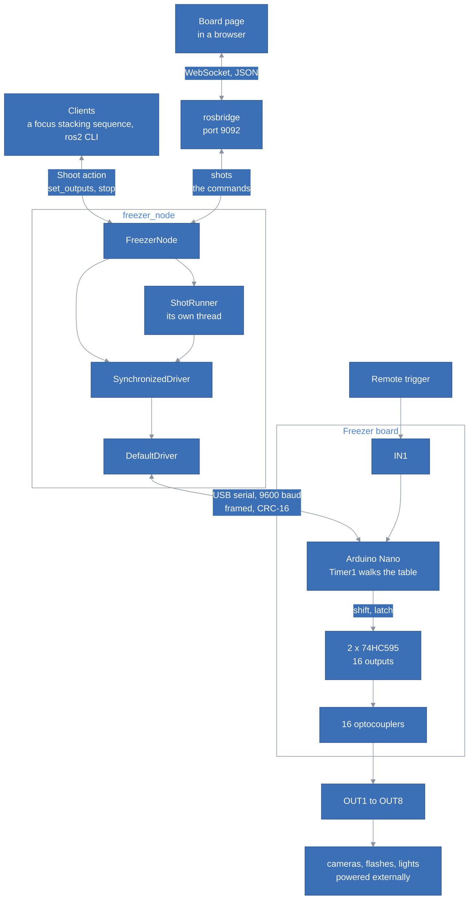
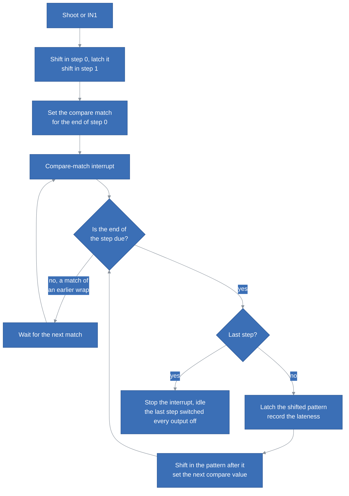
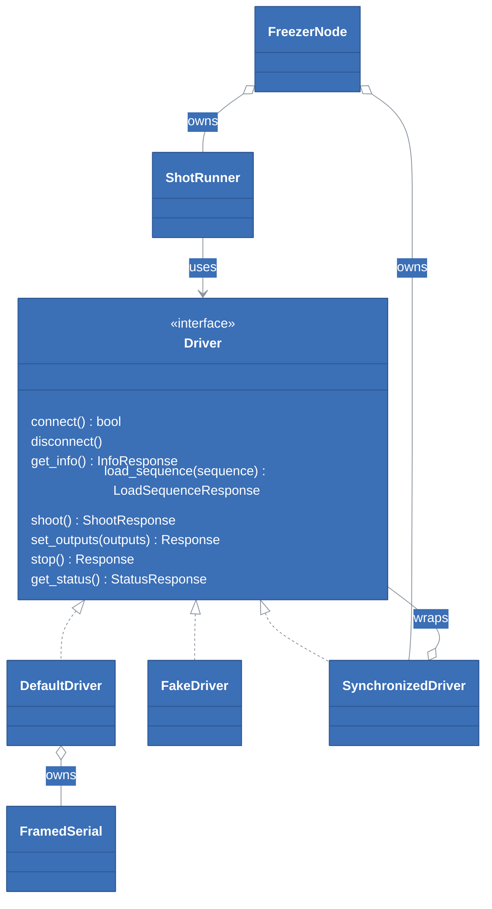
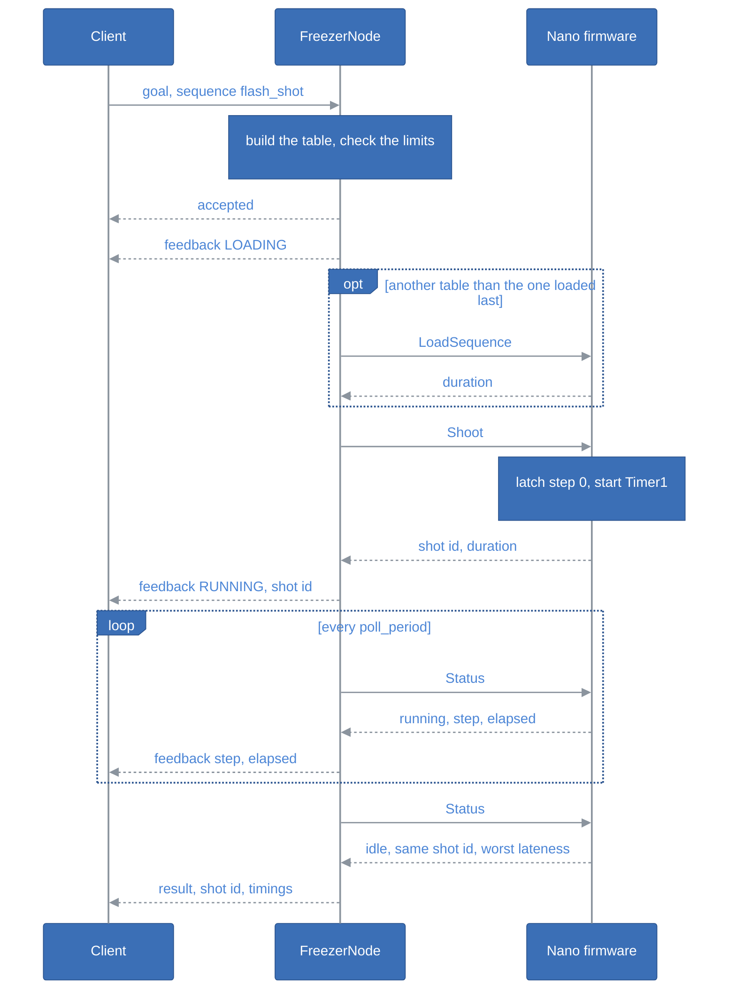
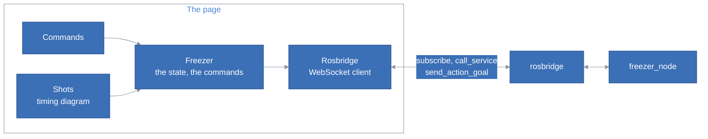

# Freezer Driver Architecture

## Table of Contents <!-- omit in toc -->

- [Introduction](#introduction)
- [The Big Picture](#the-big-picture)
- [The Packages](#the-packages)
- [The Board](#the-board)
- [The Protocol](#the-protocol)
  - [Commands](#commands)
  - [Errors](#errors)
  - [The Handshake and the Version](#the-handshake-and-the-version)
- [The Controller](#the-controller)
  - [States](#states)
  - [The Shot Owns the Outputs](#the-shot-owns-the-outputs)
  - [Running a Shot on Timer1](#running-a-shot-on-timer1)
  - [What the Controller Rejects](#what-the-controller-rejects)
- [The Remote Trigger](#the-remote-trigger)
- [The Host](#the-host)
  - [Driver](#driver)
  - [DefaultDriver](#defaultdriver)
  - [FakeDriver](#fakedriver)
  - [SynchronizedDriver](#synchronizeddriver)
  - [Sequence and the Recipes](#sequence-and-the-recipes)
  - [ShotRunner](#shotrunner)
  - [FreezerNode](#freezernode)
- [A Shot from the Host](#a-shot-from-the-host)
- [Stopping a Shot](#stopping-a-shot)
- [Losing the Controller](#losing-the-controller)
- [Seeing the Board](#seeing-the-board)
  - [What the Node Tells](#what-the-node-tells)
  - [The Board Page](#the-board-page)
- [Safety Nets](#safety-nets)
- [Tests](#tests)
- [Design Decisions and Trade-offs](#design-decisions-and-trade-offs)

## Introduction

This document explains how Freezer Driver is built: the board, the protocol, the firmware of the Nano and the ROS2 side, what each part is responsible for, and why it is built that way. It describes the code as it is, firmware and protocol version 2.0.0. It assumes we have read the [README](../README.md). [Brainstorming.md](../Brainstorming.md) keeps the ideas we weighed on the way, including the ones we dropped.

It follows one rule: **once a shot starts, its timing belongs to the controller, and only a stop interrupts it**. The host loads a table of steps, asks for a shot and is told at once that it has started; the Nano walks the table on a hardware timer, whatever else happens on the serial port; the host polls until the controller says the shot has ended.

## The Big Picture

The Freezer board is an Arduino Nano driving two 74HC595 shift registers, whose 16 outputs drive 16 optocouplers, wired to 8 output jacks. An optocoupler only closes a switch: cameras, flashes and lights are powered by their own circuits, and the board closes their remote release, their sync or their power switch. A ninth jack, IN1, takes a remote trigger.

The node's interface:

| Name | Type | What it does |
|---|---|---|
| `~/shoot` | `freezer_msgs/action/Shoot` action | Fire a shot: a sequence named in the parameters, or a raw table of steps. Feedback while it loads and runs; the result when the controller says it has ended. |
| `~/set_outputs` | `freezer_msgs/srv/SetOutputs` service | Latch a pattern on the 16 outputs outside a shot, e.g. the lights; it stays until the next pattern, a shot, or a stop. |
| `~/stop` | `std_srvs/srv/Trigger` service | End the running shot where it is, if any, and switch every output off. |
| `~/outputs` | `freezer_msgs/msg/Outputs` topic | The pattern of the outputs, whenever it changes. |
| `~/shots` | `freezer_msgs/msg/Shot` topic | Each shot when it starts, with its table and its start time, and when it ends, stops or fails. |
| `~/fake/press_trigger` | `std_srvs/srv/Trigger` service | With the fake controller only: press IN1. |
| `use_fake`, `usb_port`, `timeout`, ... | parameters | The connection, the polling and the sequences, see the [README](../README.md#parameters). |

## The Packages

| Package | Role |
|---|---|
| `freezer_msgs` | The `Shoot` action, the `Step`, `Outputs` and `Shot` messages, and the `SetOutputs` service. No code. |
| `freezer_driver` | The host side of the protocol, with no ROS interface: the `Driver` interface and its implementations, the sequence and its rules, the recipes, and `ShotRunner`. Its tests are in its `tests` folder. |
| `freezer_node` | The node `freezer`, its parameters and its launch file, which also starts the board page and its rosbridge, and its test. |
| `framed_serial`, `serial` | The framed serial protocol and the serial port, libraries in submodules under `modules`. |
| `freezer_mcu` | The firmware of the Nano, a PlatformIO project in `src/freezer_mcu`, not built by colcon. |
| `web` | The board page, in React and TypeScript, built with Vite and pnpm by the scripts in `bin`, not by colcon. |

`freezer_driver` knows nothing of ROS, apart from its logger, so that a shot can run and be tested on a fake controller and a fake clock, with no node and no time passing.

## The Board

The firmware drives the shift registers on port D: `MR` on D2, `SH_CP` on D3, `DS` on D4, `OE` on D5 and `ST_CP` on D6. IN1 is on D7, pulled down by R2. The circuit, the PCB and the Gerber files of the board are in [docs/hardware](hardware/README.md); the pin labels of the circuit are wrong, and the PCB and the firmware agree.

The 16 bits shift out least significant first, so bit 0 ends in the last stage of the chain. Each jack has two bits:

| Bits | Jack | Use |
|---|---|---|
| 0 and 1 | OUT1 | bit 0 the shutter line, the tip of the plug; bit 1 the focus line, its ring |
| 2 to 13 | OUT2 to OUT7 | the same layout, two bits a jack |
| 14 and 15 | OUT8 | the flash in the default sequences; a flash or a light jack closes both lines |
| - | IN1 | the remote trigger, on D7 |

The latch is what makes a step precise: all 16 outputs change together on the rising edge of `ST_CP`, however long the 16 bits took to shift in. The firmware shifts the next pattern in during the current step, and only latches it when the step ends.

## The Protocol

The host and the Nano speak the framed protocol of the `framed_serial` library: frames delimited by `0x7E`, escaped with `0x7D`, ending with a CRC-16, at 9600 baud. The first byte of a request is the command id; the first byte of a response is `0x11` for success or `0x12` for an error, followed by a reason. Numbers are most significant byte first. It is strictly one request, one response: the controller never speaks first, so a frame the host did not ask for can never be mistaken for the answer to its next request.

### Commands

| Id | Command | Request payload | Success payload |
|---|---|---|---|
| `0x76` | `Info` | none | version, limits and the name `FREEZER`, see [The Handshake](#the-handshake-and-the-version) |
| `0x79` | `Echo` | anything | the same bytes |
| `0x7B` | `LoadSequence` | step count, 1 byte; per step: type, 1 byte; outputs, 2 bytes; hold, 4 bytes in µs | duration, 4 bytes in µs |
| `0x7C` | `Shoot` | none | shot id, 2 bytes; duration, 4 bytes in µs |
| `0x75` | `Status` | none | state, 1 byte, 0 idle or 1 running; last shot id, 2 bytes; step, 1 byte; elapsed, 4 bytes in µs; worst lateness of the last shot, 4 bytes in µs |
| `0x77` | `SetOutputs` | outputs, 2 bytes | none |
| `0x78` | `Stop` | none | none |

- **A step** is a type, `0x00` "set and hold", the only one; the 16 outputs; and how long to hold them. 16 steps make a request of 114 bytes, under the 200 bytes of the receive buffer.
- **The shot id** counts from 1 after every reset, wraps back to 1 after `0xFFFF`, and is 0 when no shot has run since the reset. A shot fired by IN1 takes an id too.
- **A shot is over** for the host when the state is idle and the last shot id is the one `Shoot` returned.

### Errors

| Reason | When |
|---|---|
| `0x01` malformed | an unknown command id, or a payload of the wrong length |
| `0x02` invalid table | the table breaks a rule of [What the Controller Rejects](#what-the-controller-rejects) |
| `0x03` busy | `LoadSequence`, `Shoot` or `SetOutputs` while a shot runs |
| `0x04` no table | `Shoot` before any table is loaded |

### The Handshake and the Version

The path of a serial port does not tell what is plugged in, so `DefaultDriver::connect()` sends `Info` and checks the answer:

| Field | Size |
|---|---|
| status | 1 byte, `0x11` |
| version | 3 bytes: major, minor and patch |
| maximum steps | 1 byte, 16 |
| minimum hold | 4 bytes, 40 µs |
| maximum duration | 4 bytes, 10 s |
| name | the remaining bytes, in ASCII: `FREEZER` |

The driver accepts the controller only when the name is `FREEZER`, not another device on the wrong port, and its major version is the one the driver speaks, 2. The major version changes whenever the bytes on the wire change, so a driver never reads a controller it does not understand: flash the firmware of the same workspace. The node keeps the limits, and checks every table against them before sending it.

**The Nano resets when the port opens.** The DTR line of its FT232 resets it, and its bootloader listens for an upload for about 0.65 s before the firmware starts, losing any frame sent meanwhile. The driver waits `connect_delay`, 1 s, after opening the port, then tries `Info` up to 5 times, 100 ms apart. The node keeps the port open for its whole life, because every reopen restarts the controller, which forgets its table and switches its outputs off.

## The Controller

The firmware, in `src/freezer_mcu`, is plain Arduino code with three parts:

| File | Role |
|---|---|
| `main.cpp` | The pins, the commands, the checks of a table, and the remote trigger. `loop()` serves the serial port and reads IN1. |
| `Sequencer.cpp` | The loaded table and the shot: Timer1, its interrupts, and the direct port writes to the shift registers. |
| `SerialPort.cpp`, `DataBuffer.cpp`, `CrcUtils.cpp` | The framed protocol, the firmware side of `framed_serial`. |

It uses 857 of the 2048 bytes of RAM of the Nano.

### States

```mermaid
---
config:
  theme: base
  themeCSS: ".edgeLabel p { padding: 4px 10px; }"
  flowchart:
    padding: 20
    nodeSpacing: 40
    rankSpacing: 50
  class:
    padding: 16
  sequence:
    boxMargin: 12
    boxTextMargin: 8
    noteMargin: 28
    messageMargin: 40
    actorMargin: 60
    labelBoxWidth: 56
    labelBoxHeight: 28
  themeVariables:
    primaryColor: "#3b6fb6"
    primaryTextColor: "#ffffff"
    primaryBorderColor: "#2c5590"
    lineColor: "#8b949e"
    textColor: "#4d86d6"
    actorBkg: "#3b6fb6"
    actorBorder: "#2c5590"
    actorTextColor: "#ffffff"
    actorLineColor: "#8b949e"
    signalColor: "#8b949e"
    signalTextColor: "#4d86d6"
    noteBkgColor: "#3b6fb6"
    noteTextColor: "#ffffff"
    noteBorderColor: "#2c5590"
    secondaryColor: "#3b6fb6"
    tertiaryColor: "#3b6fb6"
    clusterBkg: "transparent"
    clusterBorder: "#8b949e"
    titleColor: "#4d86d6"
    edgeLabelBackground: "#3b6fb6"
    classText: "#ffffff"
    labelBoxBkgColor: "#3b6fb6"
    labelBoxBorderColor: "#2c5590"
    labelTextColor: "#ffffff"
    loopTextColor: "#4d86d6"
    mainBkg: "#3b6fb6"
    nodeBorder: "#2c5590"
    nodeTextColor: "#ffffff"
    secondaryBorderColor: "#2c5590"
    secondaryTextColor: "#ffffff"
    tertiaryBorderColor: "#2c5590"
    tertiaryTextColor: "#ffffff"
    errorBkgColor: "#3b6fb6"
    errorTextColor: "#ffffff"
---
flowchart LR
    Boot(["Power on, reset,<br/>port opened"]) -- "outputs off" --> Empty["Idle, no table"]
    Empty -- "LoadSequence" --> Loaded["Idle, table loaded"]
    Loaded -- "Shoot, IN1" --> Running["Running<br/>Timer1 owns the outputs"]
    Running -- "end of the last step,<br/>Stop: outputs off" --> Loaded

    classDef default fill:#3b6fb6,stroke:#2c5590,color:#ffffff
```

`SetOutputs`, `Stop` and another `LoadSequence` leave an idle controller in its state. What each command gets, by state:

| Command | Idle, no table | Idle, table loaded | Running |
|---|---|---|---|
| `Info`, `Echo`, `Status` | answered | answered | answered |
| `LoadSequence` | loads | replaces the table | busy |
| `Shoot` | no table | fires | busy |
| `SetOutputs` | latches | latches | busy |
| `Stop` | outputs off | outputs off | ends the shot, outputs off |
| IN1 pressed | ignored | fires | ignored |

The controller keeps no other state: there is no "armed" flag, no watchdog, and the table is not stored in the EEPROM. A reset, including the one when the port opens, brings it back to the first state.

### The Shot Owns the Outputs

Outside a shot, `SetOutputs` latches a pattern, e.g. lights on OUT8, `0xC000`, which stays until the next one. During a shot, the shot writes all 16 outputs, and nothing else may touch them: `SetOutputs` is answered busy, and only `Stop` ends the shot. A shot ends with every output off, lights included, because its last step must be `0x0000`; a host that wants the lights back sends `SetOutputs` again. A shot that needs light has the bits of the light in its steps, timed by Timer1 like the rest, as the `timed_light` recipe does.

### Running a Shot on Timer1

Timer1, the 16-bit timer, counts ticks of 0.5 µs, at a prescaler of 8 on the 16 MHz Nano; its overflow interrupt extends it to 32 bits, which wrap after about 35 minutes. The compare-match interrupt fires at the end of each step:

- **Every step starts at its own time,** computed from the start of the shot, not from the end of the previous step: a late step does not delay the next ones.
- **The interrupt only latches.** The next pattern is already in the shift stage, so the outputs change at the interrupt, within a few microseconds. Shifting the next pattern in, with direct port writes, takes the rest: about 27.5 µs per step in all, measured on the Nano. A step must therefore last at least 40 µs; shorter ones would fall behind, one after the other.
- **The interrupt measures itself.** It records the worst lateness of the shot, how late a step boundary came after its time, which `Status` returns and the result of the action reports: about 5 µs on our Nano.
- **`loop()` stays free.** The serial port is served during the shot, which is what lets the host poll and stop it. The UART and `millis()` interrupts can delay a step by a few microseconds, which does not add up from step to step, and is three orders of magnitude below the shutter lag of a camera.
- **Shared state is read atomically.** `Status` copies the state of the shot with interrupts disabled for a few microseconds, so that no 16- or 32-bit value is read half-updated on the 8-bit microcontroller.

A step that is due before its compare match could be armed, e.g. a very short one, is handled by checking the time again after arming it, instead of waiting for the counter to wrap, 32.8 ms later.

### What the Controller Rejects

A generic table moves the responsibility for a safe shot from the firmware code to the table, so the controller checks the whole table before it keeps it:

- **a last step that is not `0x0000`.** A camera must never be left with its shutter held, nor a light left on, by a shot.
- **no step, or more than 16.**
- **a type other than "set and hold".**
- **a hold under 40 µs**, which Timer1 cannot keep.
- **a hold, or a total, over 10 s.**
- **a payload whose length does not match its step count.**

A rejected table changes nothing: the previous table stays loaded, and the outputs do not move. The host checks the same rules first, with `validate()` and the limits of the handshake, so that a goal with a bad table is rejected before any serial traffic.

## The Remote Trigger

IN1 fires the loaded table, exactly as `Shoot` would, unless a shot is running or no table is loaded. It is meant for testing, and it stays simple: no arming, no setting to disable it, nothing sent to the host. A shot it fires takes a shot id like any other, which `Status` returns, and a `Shoot` from the host meanwhile is answered busy. The node learns of it by polling, see [What the Node Tells](#what-the-node-tells).

`loop()` reads IN1 at every turn. A button bounces when pressed and when released, so a level counts only once it has held for 20 ms, and only a press fires: holding the button fires once, and the bounces of the release, which come after the shot, fire nothing.

After the port opens, the Nano has reset and holds no table, so IN1 does nothing until the node has loaded one, i.e. until its first shot.

## The Host

### Driver

`Driver` is the controller as the host sees it: one method per command, each sending one request and returning its one response, with the status and, for an error, its reason. A shot runs on the controller by itself: `shoot()` returns as soon as it has started, and the caller polls `get_status()`.

### DefaultDriver

The real controller, over a `FramedSerial`. It encodes the requests, decodes the responses, throws on a response it cannot read, e.g. a short one, and makes the handshake of [The Handshake](#the-handshake-and-the-version).

### FakeDriver

A controller in software, to run the node and test it without the board. It applies the rules of the firmware, runs a shot on a clock it is given, and records every pattern it latches, and when, in a timeline. Tests drive the clock by hand, so a shot of a second takes no time, and can make it fail in the ways that are hard to provoke on the board: a shot that never ends, a reset during a shot. `trigger()` presses IN1.

### SynchronizedDriver

The node calls the controller from two threads: the shot's thread polls it, and the services call it from the executor. `SynchronizedDriver` forwards each call to the driver it wraps, one at a time, so that a stop goes between two status queries, never in the middle of one, where it would mix the bytes of two frames on the port.

### Sequence and the Recipes

`Sequence` is a table of steps, its encoding for `LoadSequence`, and its duration. `validate()` checks it against the limits of the controller, with the rules of the firmware.

The recipes turn what a photographer thinks in, cameras, flashes and delays in milliseconds, into a table of patterns, so that the ROS2 interface never speaks in bits:

| Recipe | Parameters | Steps |
|---|---|---|
| `flash` | `cameras`, `flashes`, `focus_ms`, `shutter_to_flash_ms`, `flash_ms`, `cooldown_ms` | focus, open the shutters, fire the flashes, release everything |
| `timed_light` | `cameras`, `lights`, `focus_ms`, `shutter_to_light_ms`, `light_ms`, `light_to_close_ms`, `cooldown_ms` | focus, open the shutters, lights on, lights off, release everything |

A raw table can still be sent, in the goal, for experiments.

### ShotRunner

`ShotRunner` runs one shot on a driver, from loading its table to its end, with no ROS: time comes in as a clock and a sleep, so that a test runs a shot on the clock of a `FakeDriver`, instantly and exactly.

- **It loads only what changed.** The controller does not say which table it holds, so the runner remembers the sequence it loaded last, and loads a sequence only when it differs. It forgets it whenever the controller may have lost it.
- **It polls for the end.** It sleeps `poll_period`, 10 ms, between two status queries, reports the step and the elapsed time at each, and succeeds when the controller is idle with the shot's id.
- **It gives up on a shot that does not end** within its duration plus `end_margin`, 100 ms.
- **Callbacks** let its caller cancel the shot before it is fired, and learn when it has started and how it progresses.

### FreezerNode

The node checks a goal, then runs it on a thread of its own with a `ShotRunner`, turning the runner's callbacks into feedback, `LOADING` then `RUNNING` with the step and the elapsed time, and its result into the result of the goal. One goal runs at a time: a goal is rejected while another runs, when no controller is connected, or when its table breaks a rule of the limits, with no serial traffic. A goal can be canceled while its table loads, never once the shot has started.

While no goal runs, a timer queries the controller's status every `watch_period`, to see the shots of the remote trigger, and the node tells every shot and every change of the outputs on its topics, see [Seeing the Board](#seeing-the-board).

## A Shot from the Host

The host learns the end of a shot late, by up to one polling period plus a status query, tens of milliseconds at 9600 baud, which is harmless when the cooldown alone is 200 ms. The controller, not the host's clock, decides when the shot has ended: the duration is only the host's deadline.

## Stopping a Shot

`Stop` ends a running shot where it is: the interrupt is switched off, zeros replace the next pattern in the shift stage, and are latched at once. The shot keeps its id, and the controller reads idle, exactly as after a shot that ran to its end, so the node remembers that it sent the stop and aborts the goal with the message `Stopped.`:

- **During the shot,** the stop goes to the controller between two status queries, and the next query reads idle.
- **Before the shot,** while its table loads, the node does not fire it, and the goal aborts with `Stopped before the shot started.`.
- **Between the two,** a stop that comes after the node decided to fire, and before `Shoot` reached the controller, found nothing to stop: the node sends `Stop` again as soon as the shot has started.

A stop with no goal running only switches the outputs off. A goal sent after the stop runs normally.

## Losing the Controller

The Nano resets when its power or its USB connection drops, and when the port is opened again. It then forgets its table and its shot ids, and switches its outputs off. The host notices it in two places:

- **`Shoot` answers "no table".** The runner forgets the table it loaded, loads it again, and fires once more. A second refusal aborts the goal.
- **A shot disappears.** The controller reads idle with another shot id than the one `Shoot` returned: the runner aborts the goal, saying the controller may have reset, and forgets its table, so the next shot loads it again.

A controller that never answers makes every call throw after `timeout`, and a shot that never ends aborts at its deadline.

## Seeing the Board

### What the Node Tells

Two topics tell what the board does. Each keeps its last message for a client that subscribes late (transient local), and only its last: rosbridge passes a new client the first message a topic kept, so with more, a page would open on the oldest.

- **`~/outputs`** is the pattern of the outputs whenever the node knows it changed: what `set_outputs` latched, all off after a stop and after a shot, and each step of a shot as the controller reports it when polled. A step shorter than the polling period may therefore never be published: this topic is for showing the board live, not for timing.
- **`~/shots`** tells each shot when it starts, with its table and the host time at which the controller confirmed its start, and when it ends, with how long it ran and its worst lateness, when it was stopped, or when it failed. The table and the start give the time of every step boundary to the microsecond, since the controller runs the table exactly; the time at which a message reaches a client gives it only to a few milliseconds.

The node only talks to the controller during its own shots, so it would never see one fired by IN1. While no goal runs, it queries the status every `watch_period`, 200 ms by default. A new shot id is a shot of the trigger: it runs the table the node loaded last, and the time the status says it has run gives its start. The node follows it to its end at the same period, and tells it on both topics, as `SOURCE_TRIGGER`. A shot shorter than the period is seen only once it ended, with its start estimated from its duration. A status taken while a goal starts is dropped, so that the goal's own shot is never taken for the trigger's.

With the fake controller, `~/fake/press_trigger` presses IN1 of the `FakeDriver`, under the lock of `SynchronizedDriver`, so that the trigger can be tried without the board.

### The Board Page

The board page, in `web`, fires the commands and draws the timing of each shot. It reaches the node through rosbridge, a WebSocket that speaks JSON, so that the browser needs no ROS: the launch file starts a rosbridge of its own, on port 9092, since a rosbridge only knows the messages installed next to it, and serves the built page with Python's HTTP server, on port 8092.

| File | Role |
|---|---|
| `src/ros/rosbridge.ts` | The connection: topics, service calls and action goals over the rosbridge protocol. It reconnects by itself, and subscribes again after a reconnection. |
| `src/freezer/freezer.ts` | The node as the page sees it: a store of the outputs, from `~/outputs`, and of the last shots, from `~/shots`, and one method per command. React reads it with `useSyncExternalStore`. |
| `src/freezer/board.ts` | The 16 lines and their bits, the rows of the timing diagram. |
| `src/freezer/timeline.ts` | When each line is on during a shot, from its table: the spans, the step at a time, the ticks of the axis. |
| `src/components` | The commands, and the timing diagram: a row per line, with its LED lit as `~/outputs` tells it, and the trace of the latest shot. |

The timing diagram is plain SVG: a row per line, high while it is closed, as a logic analyser draws it. The rows are named after the contacts of the plug, e.g. `OUT1 ring` and `OUT1 tip`, not after a device: the jacks are all alike, and only the sequence decides that one drives a camera, whose ring is its focus and tip its shutter, and another a flash. It draws the shot from its table, so it shows what the controller was told to do, to the microsecond, not a measurement of what it did; the worst lateness, which the controller measures, is in the result of the action and on `~/shots`. A running shot has a cursor, which advances on the page's own clock from the moment its start arrived, so that a host on another clock does not move it. A stopped shot is cut where it stopped. A shot whose end never reaches the page, e.g. after a lost connection, counts as running for its duration and 2 s more, `END_GRACE_MS`, and then no more: the page disables the commands while a shot runs, and must not keep them disabled forever.

## Safety Nets

- **A shot ends with every output off.** The controller and the host both refuse a table whose last step is not `0x0000`, so no shot leaves a shutter held or a light on.
- **A table is checked whole before anything changes.** A rejected table leaves the previous one loaded and the outputs as they were.
- **Outputs start off.** At power on and at reset, the firmware disables the outputs, clears the registers, latches the zeros, then enables them, so that whatever the 74HC595 held never reaches a camera.
- **A shot runs to its end, unless stopped.** Nothing else cuts it short: releasing a shutter mid-way leaves a camera in an unknown state, so the host's cancel only works before the shot starts. `Stop` is the deliberate exception.
- **The shot owns the outputs.** Nothing changes them while it runs, so a light switched by mistake cannot spoil an exposure.
- **The handshake refuses the wrong device and the wrong firmware,** by name and by major version.
- **A shot that never ends is abandoned** by the host after its duration plus `end_margin`.
- **IN1 is debounced,** so a press fires one shot.

What is deliberately not there:

- **No watchdog.** The controller does not act when the host goes silent; it keeps its outputs: a shot ends by itself, and what `SetOutputs` set, a light or even a camera bit, stays until it is changed, stopped, or the Nano resets. A node that restarts opens the port, which resets the Nano and switches every output off.
- **No checksum of the table.** `Shoot` fires whatever table is loaded; the host knows what it loaded.

## Tests

The tests run without the board: `DefaultDriver` against a mock of `FramedSerial`, everything else against `FakeDriver`.

| Test | What it covers |
|---|---|
| `test_default_driver` | The frames each command sends and how each response is read, the handshake, its retries and its refusals, the errors. |
| `test_fake_driver` | The fake runs a table, records its timeline, owns the outputs during a shot, stops, fires from IN1, and fails when told to. |
| `test_sequence` | The encoding of a table and the rules of the controller. |
| `test_recipes` | Each recipe produces the expected table, and the jack to bit mapping. |
| `test_shot_runner` | A shot from load to end on a clock the test moves: the callbacks, a table loaded once, a cancel, a refused table, a shot that never ends, a reset during and between shots. |
| `test_freezer_node` | The ROS2 interface end to end: the action, its rejections, the services, a stop during a shot, a goal during a shot of IN1, the topics, and the shots of the trigger the node sees while idle. |

The board page has tests of its own, with vitest, run by `bin/test.sh` and by the `Web` workflow of CI: the bits of the board, the timeline of a shot, how the shot messages make the list of shots, and the rosbridge client against a fake WebSocket.

The firmware has no automated test. The timing, the microseconds between latches, needs the board and a logic analyser or an oscilloscope on `ST_CP`; the rest, the commands, the states and IN1, is checked by hand on the Nano.

## Design Decisions and Trade-offs

**Timer1 runs the shot, not `delay()`.** The sketch the board came with chained `delay()` calls and `digitalWrite`s: each step changed a few hundred microseconds late, the error added up, and the controller was deaf for the whole shot. A compare-match interrupt that only latches a pattern shifted in ahead keeps every step within a few microseconds of its time, and leaves `loop()` free to answer the host. Disabling interrupts for the whole shot would make the timing perfect, but the controller could then neither answer nor stop, and a few microseconds of jitter are far below the jitter of a camera.

**The table is loaded, then fired.** A shot could carry its table, and since what matters is how precisely a shot runs, not how soon it starts, the few milliseconds of a bigger frame would not matter. We kept the load for IN1: a button has no table to send, so the controller must hold the one it fires. The loaded table is therefore the shot, whoever fires it, the host or the button. Loading once also means that a focus stack of 200 shots sends its table once.

**The host builds the table; the controller only replays it.** The firmware stays small, and a new kind of shot, e.g. a camera fired later than the others, needs no new firmware: the recipes on the host know the cameras, the flashes and the delays, and the controller only knows bits and microseconds.

**The host polls for the end of a shot.** `Shoot` answers at once with the duration, and the host polls `Status` every 10 ms until the shot has ended. It keeps the protocol to one request, one response, and the controller remains the authority on the end. A second answer sent by the controller at the end of the shot would tell the host about 10 ms sooner, but it breaks the pairing of requests and responses: telling the two answers apart takes sequence numbers, and recovering a lost one takes retransmissions, which can fire a shot twice.

**The shot owns the outputs, and only `Stop` interrupts it.** A shot is the reason the board exists, so nothing may change its outputs while it runs. Refusing `SetOutputs` with "busy", rather than ignoring it, tells the host that its outputs did not change, which a strict request and response protocol requires anyway.

**The node knows a shot was stopped; the controller does not say.** A stopped shot reads idle with its id, like one that ended. Only the node sends `Stop`, so it is the one place that knows, and the protocol needs no field for it.

**No checksum.** Version 1 had `LoadSequence` return the CRC-16 of the table, and `Shoot` send it back, so that the controller refused to fire a table the host did not mean. One host owns the port, so it only guarded against that host's own mistakes, which the runner avoids by remembering what it loaded. The CRC-16 of every frame, which checks the link, stays.

**No watchdog.** A watchdog matters where something left running is dangerous, e.g. a motor. Here a shot ends by itself, and outputs left on outside a shot are a choice of the host, which a restart of the node clears, since opening the port resets the Nano.

**IN1 stays simple.** It is for testing: arming it, disabling it while the host is connected or reporting its shots to the host would all be state to keep in step for a button. It fires the loaded table unless a shot runs, and the only thing it needs is a debounce, because a single press must fire a single shot.

**An action for the shot, services for the outputs and the stop.** A shot has a start, a progress and an end, which is what a ROS2 action is for: a client can move a rail, wait for it to settle, send a goal and wait for its result. Setting the outputs and stopping are immediate, so a service, which answers at once, fits them better. `ros2_control` does not fit: there is no joint and no control loop.

**A page to see the board, not RViz or PlotJuggler.** A URDF in RViz moves links from joint states, but their colours are fixed, so it cannot light a switch. PlotJuggler draws a timing diagram, but cannot fire a shot. A page can do both, looks like the board, and works the same against the fake controller and the real one. It draws the latest shot, whose timing shows what the outputs did, with an LED on each row showing the line as it is now, which also shows what no shot does, e.g. All on. During a shot, the LEDs show the shot's table at the cursor rather than `~/outputs`: the node learns each step when it polls the controller, at another moment than the cursor reaches it, and the two would disagree for a few milliseconds at each boundary, tens on the board.

**The timing diagram is drawn from the table.** Stamping each change when its message reaches the page would draw a 100 ms step as anything between 97 and 104 ms. The controller runs the table exactly, so the table and the confirmed start are the truth, to the microsecond; `~/outputs`, coarser, only lights the board.

**The node polls for the trigger, rather than the controller telling it.** The controller stays strictly request and response, and IN1 stays simple. A status query every 200 ms while idle costs little, and only matters for showing the trigger's shots.

**The Nano, at 9600 baud.** The board is designed for the footprint of the Nano, and its 2 KB of RAM are enough: the firmware uses 857 bytes. At 9600 baud, an `Info` round trip takes about 48 ms, and a status query tens of milliseconds, so the host polls a little slower than `poll_period` asks and learns the end of a shot a little later; the timing of the shot itself does not depend on the serial port at all.
